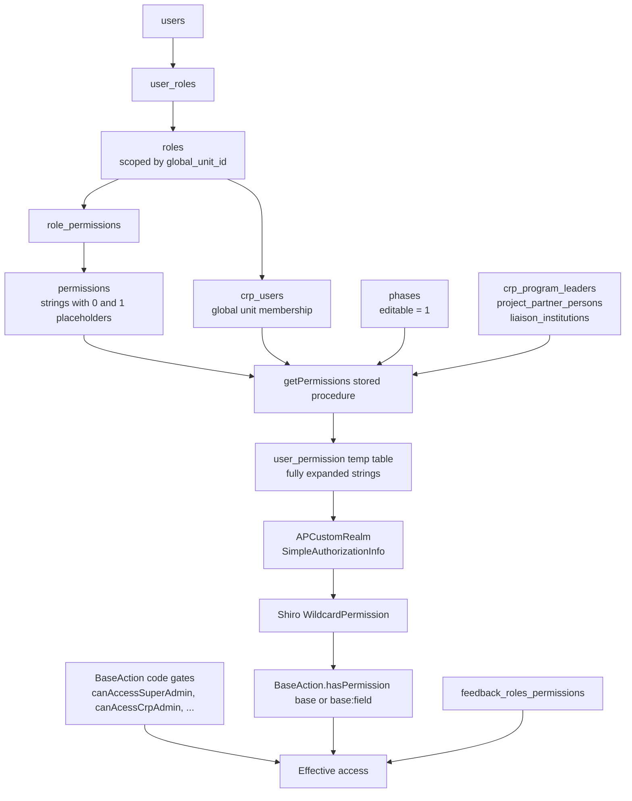

# Admin — Roles & Permissions Documentation — Design

**Spec ID:** DOMAIN-ADMIN-001
**Status:** Draft
**Owner:** IBD Team — Kenji Tanaka
**Last Updated:** 2026-09-01
**Requirements:** `docs/specs/domain/admin/requirements.md`
**Deliverable:** `docs/specs/domain/admin/roles-permissions-catalog.md`

> This spec produces a document, not a code change. Sections that describe code the spec would modify are marked
> "Not applicable". The **Architecture Summary** and **Security Considerations** sections describe the
> authorization model *as built*, because that description is the deliverable's subject matter.

---

## 1. Architecture Summary

MARLO resolves authorization in four layers. The catalog documents each one and how they compose.

Three properties drive everything the catalog says:

1. **Placeholder expansion.** `{0}` becomes `<global unit acronym>:<phase description>:<phase year>`; `{1}` becomes
   a project id or a `crp_programs` id, resolved by the branch of `getPermissions` that matches how the user is
   attached to that object (program leader, project partner person, liaison institution, finance person).
2. **Phase scoping.** The procedure only emits rows for phases with `editable = 1`, so a grant is inert while the
   phase is closed. This is what freezes AICCRA (GU 45) and opens AICCRA III (GU 47, phase 444 `Planning 2026`).
3. **Node grants cascade.** `BaseAction.hasPermission(field)` accepts the base permission alone, so a grant that
   stops at a section unlocks the whole section.

## 2. Module Footprint

### docs
- New: `docs/specs/domain/admin/requirements.md`
- New: `docs/specs/domain/admin/design.md`
- New: `docs/specs/domain/admin/task.md`
- New: `docs/specs/domain/admin/agent-context.md`
- New: `docs/specs/domain/admin/roles-permissions-catalog.md`

### marlo-web / marlo-data / marlo-core / marlo-utils
- Not applicable. No source file is added or changed by this spec.

## 3. Data Model Changes

Not applicable — no schema change. The tables the catalog reads, and the semantics it documents:

| Table | Role in the model | Notable property |
|---|---|---|
| `roles` | Role per global unit | `global_unit_id` scopes the role; `acronym` is the Shiro role name; `order` drives Admin → Users tab order |
| `permissions` | Permission string catalog (245 rows) | `type`: `0` global unit, `1` project, `3` program; `crp:{0}:fundingSource:*` is duplicated (ids 450, 451) |
| `role_permissions` | Grant join | No unique index on `(role_id, permission_id)`; duplicates exist |
| `user_roles` | Assignment join | No unique index on `(user_id, role_id)`; duplicates exist |
| `crp_users` | Global unit membership | `getPermissions` requires it to match `roles.global_unit_id` |
| `phases` | Phase catalog | `editable = 1` is a precondition for every emitted grant |
| `custom_parameters` + `parameters` | Role id resolution (`crp_*_rol`) | Values differ per global unit |
| `feedback_roles_permissions` | Feedback matrix | Rows exist for global unit 45 only |
| `cluster_types` | `1` Country, `2` Theme, `3` Management, `4` Regional | The seed migration uses different ids — catalog §11.6 |

## 4. API / Action Surface

Not applicable — no action or endpoint is added. The catalog documents the existing surface it depends on:
`crpUsers`, `management`, `regionalMapping`, `siteIntegration`, `ppaPartners`,
`feedbackRolesPermissionsManagement` (all under `/admin`), plus the `api:*` permission family used by the `AR`
and `ARW` service-account roles.

## 5. Frontend Composition

Not applicable for changes. The catalog cites, as evidence of what users see:

- `marlo-web/src/main/webapp/WEB-INF/crp/views/admin/menu-admin.ftl` — the Admin submenu inventory.
- `marlo-web/src/main/webapp/WEB-INF/crp/views/admin/crpUsers.ftl` — role tabs rendered with
  `role.aiccraAcronymDimanic`.
- `marlo-web/src/main/webapp/WEB-INF/global/pages/main-menu.ftl` — which modules are reachable, including the
  entries hardcoded to `visible: false` (Publications, POWB, Annual Report, QA).

## 6. Persistence & Phase Replication Plan

Not applicable — the spec writes no data. Phase behaviour is documented, not altered: role grants are not phased
data, but their *effect* is phase-gated through `phases.editable`, which is why the catalog reports the open phase
alongside the matrix.

## 7. Validation & Save Pipeline

Not applicable — no save path is touched.

## 8. Permissions & Edit Gates

The catalog is the inventory of these gates. Documented, not modified:

| Gate | Source |
|---|---|
| `canAccessSuperAdmin()`, `canAcessCrpAdmin()`, `canAcessSumaries()`, `canAcessImpactPathway()`, `canAcessFunding()`, `canAcessPublications()`, `canAcessPOWB()` | `BaseAction.java` |
| `hasPermission()`, `hasPermissionNoBase()`, `hasPermissionDeliverable()`, `hasPersmissionSubmit()` | `BaseAction.java` |
| `canLeaveComments()`, `canApproveComments()`, `canManageFeedback()`, `canTrackComments()` | `BaseAction.java` + `feedback_roles_permissions` |
| Struts interceptors (`canEditProject`, `accessibleAdmin`, `canEditCrpAdmin`, …) | `reports/ai-context/interceptor-validator-playbook.md` |

## 9. Specificity / Feature-Flag Strategy

No new specificity. The catalog documents the existing role-id parameters (`crp_admin_rol`, `crp_pmu_rol`,
`crp_fpl_rol`, `crp_fpm_rol`, `crp_rpl_rol`, `crp_rpm_rol`, `crp_pl_rol`, `crp_pc_rol`, `crp_cp_role`,
`crp_cl_rol`, `crp_sl_rol`, `crp_cd_rol`) and the module flags that decide whether a grant is reachable
(`crp_admin_active`, `crp_impPath_active`, `crp_bi_module_active`, `feedback_active`, `tip_section_active`,
`ai_section_active`, `crp_leverages_module`, `crp_lp6_active`, `crp_lessons_active`, `innovation_section_active`,
`crp_activities_module`, `crp_capdev_active`, `crp_has_contact_point`, `crp_has_regions`).

## 10. Integration Points

- **CLARISA / REST consumers** — the `AR` and `ARW` roles are documented as service accounts (`api:*:read`,
  `api:*:create|update|delete`), which is how external integrations authenticate.
- No other integration is involved.

## 11. Observability

Not applicable for new instrumentation. The catalog's §10 provides the audit queries that make the
authorization state observable, including the duplicate-grant audit.

## 12. Performance & Scalability

Not applicable for the deliverable. One observation carried into the catalog: duplicate rows in `user_roles` and
`role_permissions` multiply the rows `getPermissions` writes into the `user_permission` temp table on every
authorization cache miss (`SL` on GU 45: 129 rows for 13 users), so de-duplication is a performance item as well
as a hygiene one.

## 13. Security Considerations

- **Verification was read-only.** Only `SELECT` and `CALL getPermissions(<id>)` were issued;
  `getPermissions` writes only to a session-local temporary table.
- **No credentials or personal data in the deliverable.** Database access used the gitignored
  `marlo-web/src/main/resources/config/marlo-dev.properties`; the catalog reports user populations as counts.
- **The catalog is an attack-surface map.** It enumerates which roles reach which sections. It belongs in the
  repository and in internal tooling, and should not be published outside the organization.
- **Findings with a security dimension:** cross-tenant `crp:*` on `CRP-Admin` (§11.9), a role with users and no
  grants (§11.1), and grants that cannot match at runtime (§11.5).

## 14. Backwards Compatibility & Rollout

No migration, no flag, no rollback path. The spec lands as documentation on a feature branch off `staging`.
The rendered summary published on Jira A2-2022 (comment `41599`) is regenerated from the repo file, which stays
the source of truth.

## 15. Decision Records

- **ADR-1 — Split the matrix by grant scope instead of one flat table.** `permissions.type` separates global-unit,
  project and program grants, and the same section name appears in more than one scope (`fundingSource`). One flat
  table would be 245 rows wide of ambiguity; three tables are each readable and unambiguous.
- **ADR-2 — Symbols plus a full appendix, not prose per role.** The matrix answers "can role X touch section Y"
  at a glance; Appendix A carries the exact permission strings for anyone who needs the literal grant. Prose alone
  cannot be diffed when the configuration changes.
- **ADR-3 — Document reachability separately from grants.** Roughly a third of the grant families target modules
  AICCRA III does not expose. Reporting grants without reachability would overstate access; deleting them from the
  matrix would hide configuration that is still live in the database. Both are reported, in separate sections.
- **ADR-4 — Use global unit 47 for the grant lists.** The epic targets AICCRA III. Parity with global unit 45 was
  verified by query, so one appendix serves both.
- **ADR-5 — Keep findings inside the catalog rather than in a separate report.** They were discovered from the
  same evidence and are only meaningful next to it; each one still carries enough detail to be lifted into a ticket.

## 16. Open Risks

- **Snapshot drift.** The catalog is true as of 2026-09-01 against `aiccradb1`. Any role or permission change in
  production invalidates counts. Mitigation: §10 queries plus the snapshot header.
- **Local copy may lag production.** `aiccradb1` is a local copy; on it, only phase 444 is editable and
  `feedback_roles_permissions` has rows for global unit 45 only. Both facts should be reconfirmed in production
  before acting on findings §11.7 and §11.1.
- **Unverified role population.** Roles with 0 users locally (`FM`, `DM`, `CL`, `ML`, `E`, `AR`, `ARW`, `CD`) may
  have users in production. Finding §11.10 must be reconfirmed there before any retirement decision.
- **Published-copy divergence.** The Jira comment on A2-2022 is a point-in-time render. If the catalog changes
  and the comment is not re-published, the two disagree with no detection mechanism.
