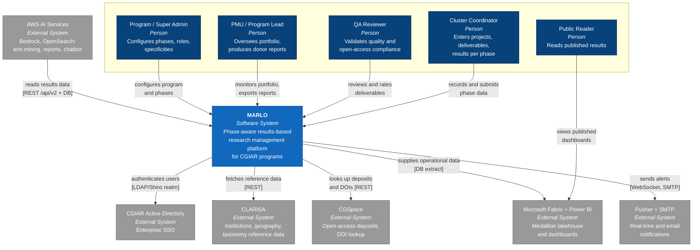
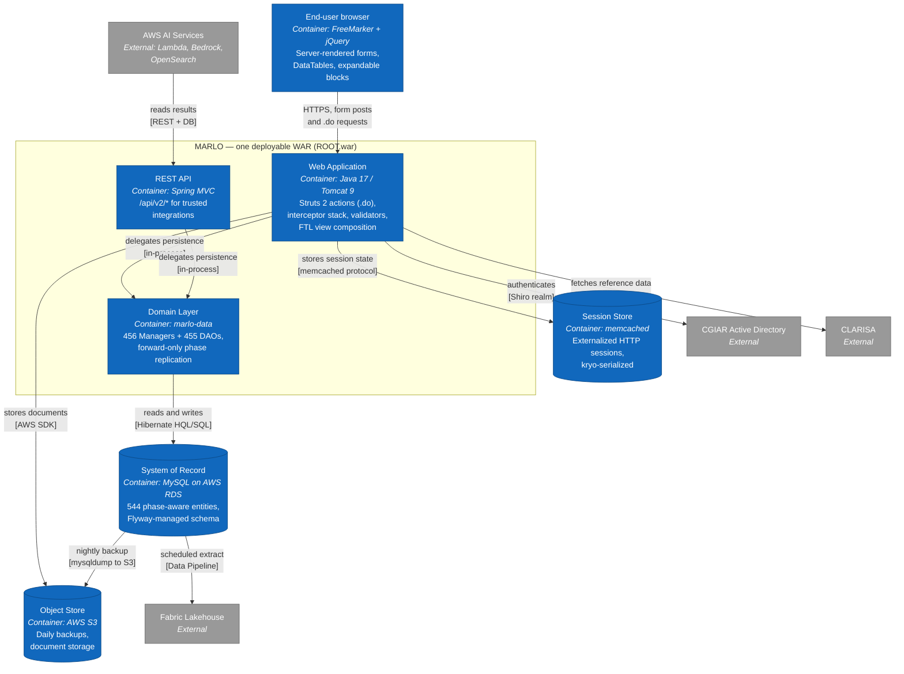

# MARLO — Technical Requirements Document (TRD)

**Status:** Living document. Version: 1.1 (Constitutional Baseline).
**Owner:** IBD Team — Alliance of Bioversity International and CIAT.
**Last Updated:** 2026-08-27.
**Related:** [docs/prd.md](../prd.md), [docs/ux-ui/design.md](../ux-ui/design.md), [docs/infrastructure.md](../infrastructure.md), [AGENTS.md](../../AGENTS.md), [reports/ai-context/*](../../reports/ai-context/).

> This document captures the *technical* shape of MARLO: modules, data, APIs, security, observability, and testing. It encodes the patterns the codebase already follows (see `AGENTS.md` and `reports/ai-context/*`) and the architectural commitments that future module specs MUST honor.

> **Section numbering note.** This document predates the current AKILI TRD section order. Sections
> §1–§12 keep their original numbers because seven live spec folders under `docs/specs/` cite them by
> section number; renumbering would silently break those citations. The two AKILI sections added in
> version 1.1 — **Architecture Overview & Decisions (§13)** and **Quality Attribute Scenarios
> (§14)** — are appended instead. **§13.0 holds the full AKILI-section-name → local-number map.**
> Formerly `docs/detailed-design/detailed-design.md`; renamed during `/akili-constitution` 2026-08-27.

---

## 1. System Overview

MARLO is a Java EE web application that:

- Persists transactional research-management data in a phase-aware MySQL database.
- Renders form-driven UIs over Apache Struts 2 + FreeMarker.
- Exposes a Spring MVC REST API under `/api/*` for trusted integrations.
- Enforces authentication and authorization via Apache Shiro + CGIAR Active Directory.
- Replicates phased data forward through a recursive `ManagerImpl` pattern.
- Feeds an external Microsoft Fabric / Power BI ecosystem (Bronze / Silver / Gold).
- Hosts AI services (Text Mining, Reports Generator, Chatbot) on AWS that consume MARLO data via the REST API and the database.
- Runs on AWS for production (Virginia) and on-premise at CIAT Palmira for Test, with Staging coming online.

### 1.1 High-level architecture

```
                +-----------------------+        +---------------------+
                |  CGIAR Active         |        |  CLARISA            |
                |  Directory            |        |  (institutions,     |
                +-----------+-----------+        |  geo, taxonomy)     |
                            |                    +----------+----------+
                       (Shiro auth)                         |
                            v                               | (REST)
+--------------------+  +---v-------------------+   +-------v---------+
|  End-user browser  |->| MARLO Web (Tomcat 9) |-->|  CLARISA client |
|  (FTL + jQuery)    |  | Struts 2 + Spring MVC|   +-----------------+
+--------------------+  +---+-------------------+
                            |
                            | Hibernate (HQL/SQL)
                            v
                   +--------+----------+    +----------------------+
                   |  AWS RDS (MySQL)  |    | AWS S3 (backups,     |
                   +--------+----------+    | document store)      |
                            |               +----------------------+
                            | (extract / pipelines)
                            v
                   +--------+----------+
                   | Microsoft Fabric  |
                   | Lakehouse (Bronze |
                   | / Silver / Gold)  |
                   +--------+----------+
                            |
                            v
                   +--------+----------+    +----------------------+
                   | Power BI Service  |<-->| Public embed tool    |
                   +-------------------+    +----------------------+

                   +-------------------+    +----------------------+
                   | AWS Lambda        |    | AWS Bedrock          |
                   | (AI/automation)   |<-->| (Claude, Titan)      |
                   +--------+----------+    +----------+-----------+
                            |                          |
                            v                          v
                   +--------+--------------------------+----+
                   | Amazon OpenSearch (vector indices)     |
                   +----------------------------------------+
```

### 1.2 Deployment topology

- **Production (AWS, Virginia)** — multiple EC2 instances: core application, frontend, CLARISA integration, automation, backup. Lambda for specific AI/automation tasks. RDS MySQL as system of record. S3 for backups and documents.
- **Test (CIAT Palmira)** — on-premise; reachable via FortiClient VPN.
- **Staging** — being built out to mirror Production behind GlobalProtect VPN.
- **CI/CD** — Jenkins (https://automation.prms.cgiar.org/) is triggered by the GitHub Actions workflows under `.github/workflows/` (`jenkins-trigger*.yml`). Dedicated SonarCloud workflow files are not present in this checkout; treat Sonar/static-analysis execution as CI-environment dependent unless the workflow is added.

---

## 2. Domain Modules & Responsibilities

MARLO is structured as a multi-module Maven project. The aggregator (`marlo-aggregator`, `pom.xml` at repo root) drives a build over five modules.

| Module | Responsibility | Key contents |
|---|---|---|
| `marlo-parent` | Dependency and plugin management. No executable code. | `pom.xml` declares `struts2`, `hibernate`, `spring`, `shiro`, `mysql`, `flyway`, etc. (see `marlo-parent/pom.xml`). |
| `marlo-utils` | Pure utility classes (dates, strings, file processing for Excel/CSV/PDF, JSON helpers, constants). | `org.cgiar.ccafs.marlo.utils.*`. |
| `marlo-core` | Minimal servlet/Spring bootstrap shared by the web tier. No domain code. | `org.marlo.core.CoreAppContextConfig`, `org.marlo.core.WebAppInitializer`. |
| `marlo-data` | Domain layer: JPA/Hibernate entities (`model`), `dao`/`mapper`, Manager interfaces and implementations. Audit listeners. Also hosts the Shiro / Hibernate wiring. | `org.cgiar.ccafs.marlo.data.{model,dao,manager,mapper}`; `IAuditLog`, `HibernateAuditLogListener`, `AuditColumnHibernateListener`; `MarloShiroConfiguration`, `MarloLocalSessionFactoryBean`, `MarloDatabaseConfiguration`. |
| `marlo-web` | Web tier: Struts actions, REST controllers, FreeMarker templates, validators, interceptors, Spring MVC config, web resources, SQL migrations. | `org.cgiar.ccafs.marlo.action.*`, `rest.controller.v2.*`, `validation.*`, `interceptor.*`. |

### 2.1 Action package map (`marlo-web`)

Top-level Struts action packages and their domains:

- `action/ai` — AI-related screens (e.g., `AiAction`).
- `action/annualReport` — Annual Report synthesis sections.
- `action/bi` — BI dashboard hub (`BiReportsAction`).
- `action/center` — CGIAR Center program flows.
- `action/crp` — CRP-level admin and shared flows.
- `action/deliverable` — Deliverable lifecycle screens.
- `action/downloads` — File/report downloads.
- `action/funding` — Funding sources.
- `action/home` — Home dashboard.
- `action/impactpathway` — Impact pathway management.
- `action/json` — Existing JSON endpoints (use punctually only).
- `action/powb` — POWB synthesis sections.
- `action/projects` — Project / cluster CRUD (Description, Partners, Locations, Activities, Deliverable, Innovation, Highlight, Case Study, Outcomes, Budgets…).
- `action/publications` — Publication flows.
- `action/qa` — Quality Assurance flows.
- `action/report` — Reporting (legacy, see also `annualReport`).
- `action/summaries` — PDF / export summaries.
- `action/superadmin` — System-level administration.
- `action/synthesis` — Cross-CRP synthesis.
- `action/tip` — Technology Innovation Profile.
- `action/BaseAction.java` — Common base class (inject `APConfig`, exposes `hasSpecificities`, current user/phase/session helpers).
- `action/MapGeolocation.java` — Geolocation helper action.
- `action/UnhandledExceptionAction.java` — Global error handler.

### 2.2 REST package (`marlo-web/src/main/java/.../rest`)

- `rest/controller/v2/controllist/` — REST endpoints (e.g., `Deliverables`, `Innovations`, `ExpectedStudies`, `Projects`, `QAToken`, `Institutions`, `GeneralLists`, `Expenditures`, `ProgressTowards`, `SrfLists`).
- `rest/controller/v2/controllist/items/` — sub-resource endpoints.
- `rest/dto/` — Data transfer objects (separated from `data.model` entities).
- `rest/mappers/` — MapStruct mappers between entities and DTOs.
- `rest/services/` — Service-layer logic for REST.
- `rest/errors/` — REST error handling and standardized responses.

### 2.3 Configuration packages (`marlo-web` core)

The Spring/Flyway bootstrap classes live in the **root package** `org.cgiar.ccafs.marlo` of `marlo-web`, not under
`config/`. The `config/` package holds Struts/FreeMarker plumbing and the web-tier constants.

- `ApplicationContextConfig.java` (root package) — Spring application context.
- `MarloRestApiConfig.java` (root package) — Spring MVC for `/api/*`.
- `MarloFlywayConfiguration.java` (root package) — Flyway migrations.
- `MarloBusinessIntelligenceConfiguration.java` (root package) — BI config.
- `WebAppInitializer.java` (root package) — Servlet container bootstrap.
- `config/SpringDocWebConfig.java` — Springdoc OpenAPI.
- `config/APConstants.java` — web-tier constants (mirror of the `marlo-data` file).
- `config/APFreemarkerManager.java`, `config/MarloLocalizedTextProvider.java` — FreeMarker and i18n plumbing.
- `config/ShiroSpringStartupListener.java` — Shiro startup hook.
- `interceptor/` — Struts interceptors (auth, CRP validation, edit gates).
- `validation/` — Action-side validators (e.g., `ProjectDescriptionValidator`).
- `security/` — App-level security helpers complementing Shiro.

---

## 3. Data Model & Entities

### 3.1 System of record

- **Engine:** MySQL (AWS RDS in production).
- **ORM:** Hibernate 5.4.x via JPA-style annotations on entities under `marlo-data/.../data/model`.
- **Connection pool:** HikariCP (current checkout: 2.4.6; upgrade to 5.x is a modernization target that requires compatibility validation).
- **Schema migrations:** Flyway 4.0.1 (`marlo-web/src/main/resources/database/migrations/`); no raw schema changes outside migrations.

### 3.2 Entity scale

The data layer holds **544 entity classes**, **456 manager interfaces** (with corresponding `*Impl`), and **455 DAOs** at the time of writing. Every persisted entity follows the layered pattern (see §3.4).

### 3.3 Phase-aware data model

Phases are first-class. The `phases` table enumerates every cycle moment (POWB / UpKeep / AR per year). Phased entities (deliverables, partners, innovations, OICRs, etc.) carry an explicit `phase_id` foreign key.

**Replication contract** (per `reports/ai-context/persistence-replication-managerimpl.md`):

1. Saves are forward-only: changes apply to current and future phases, never past.
2. From `PLANNING`, replicate through every `phase.getNext()` until exhausted.
3. From `REPORTING`, replicate to `phase.getNext().getNext()` (UpKeep) and onward.
4. Delete operations mirror save operations across the same phase chain.
5. Section-specific skip rules apply (e.g., publication deliverables skip replication).
6. Duplicate prevention filters target phases before insert.

Any change to a `ManagerImpl` save path MUST preserve this contract. Add tests that exercise the replication chain end-to-end.

### 3.4 Layered persistence pattern

For every persisted entity:

- **Manager interface** — defines business operations (e.g., `DeliverableFundingSourceManager`).
- **ManagerImpl** — implements business logic, including phase replication.
- **DAO interface** — defines persistence operations.
- **MySQLDAO** — concrete Hibernate implementation (HQL / SQL queries).

This pattern is non-negotiable: new entities MUST follow it. New code MUST NOT bypass the manager layer to talk to the DAO directly.

### 3.5 Audit logging

- `IAuditLog` interface marks auditable entities.
- `HibernateAuditLogListener` and `AuditColumnHibernateListener` (in `marlo-data/`) capture changes.
- Audit columns (`created_by`, `modified_by`, `active_since`, etc.) are populated automatically.
- Significant write paths MUST keep audit columns intact.

### 3.6 Reference data

- CLARISA-backed: institutions, countries / regions, partner types, indicator taxonomies. Synchronization is integration-driven; do NOT hand-edit these tables.
- Internal taxonomies: SLOs, IDOs, cross-cutting issues, Scaling Readiness levels, deliverable types, OICR maturity classes — managed via Admin / Super Admin screens and migrations.

### 3.7 Specificity / parameter tables

- `parameters` — one row per (`global_unit_type_id`, `key`) feature flag definition.
- `custom_parameters` — one row per (`parameter_id`, `global_unit_id`) override.
- `category = '2'` and `format = '1'` mark a specificity (boolean-like).

The constitutional flow for adding a specificity is documented in `AGENTS.md` §"Specificity Implementation Guide" and MUST be followed.

---

## 4. API Surface & Contracts

### 4.1 Two routing layers

| Layer | Pattern | Owner | Purpose |
|---|---|---|---|
| Struts 2 | `*.do`, occasionally `*.json` | Internal UI flows | All form-driven user interactions. |
| Spring MVC | `/api/*` | External consumers | REST API for trusted integrations (CLARISA, AI services, BI ingestion). |

`struts.xml` enforces the boundary: `struts.action.excludePattern = /api/*`.

### 4.2 Internal Struts routing

- Mapping files: `struts.xml` + per-domain `struts-<area>.xml` (e.g., `struts-projects.xml`, `struts-admin.xml`, `struts-powb.xml`, `struts-annualReport.xml`, `struts-impactPathway.xml`, `struts-fundingSources.xml`, `struts-bi.xml`, `struts-ai.xml`, `struts-qa.xml`, `struts-superadmin.xml`, `struts-publications.xml`, `struts-studies.xml`, `struts-summaries.xml`, `struts-synthesis.xml`, `struts-tip.xml`, `struts-data.xml`, `struts-home.xml`, `struts-json.xml`, `struts-api.xml`, `struts-report.xml`, `struts-center-*.xml`, plus legacy `struts-powb2019.xml` / `struts-annualReport2018.xml`).
- Critical routing catalog: see `reports/ai-context/struts-critical-routing-catalog.md`.

### 4.3 Interceptor stacks

Defined under `<package name="marlo-default" namespace="/" extends="struts-default">` in `struts.xml`. Key stacks (per `reports/ai-context/interceptor-validator-playbook.md`):

- `crpAdminStack` — auth/session + admin access + `canEditCrpAdmin`.
- `impactPathwayStack` — auth/session + `canEditImpactPathway`.
- `editProjectsStack` — auth/session + `canEditProject`.
- `editFSStack` — auth/session + `editFunding`.
- `editPowbStack` — auth/session + `canEditPowbSynthesis`.
- `editReportSynthesisStack` — auth/session + `canEditReportSynthesis`.
- `editProjectListStack` — lightweight, used before per-action interceptors (`editDeliverable`, `editInnovation`, `editAi`, `editHighlight`, `editCaseStudy`, `editProjectOutcome`).
- `homeStack` — landing/dashboard stack.
- `projectListStack` — includes `SecurityControl`; used for existing JSON endpoints.

Constitutional rules:

1. Every new `.do` action MUST declare an interceptor stack — no anonymous defaults for write paths.
2. Stacks MUST run permission checks (`canEdit*`, `editFunding`, `accessibleAdmin`) before action execution.
3. Action-side `validate()` MUST be guarded with `if (save) { ... }` and call the matching `Validator`.

### 4.4 REST API (Spring MVC, `/api/v2/*`)

- Controllers live in `rest/controller/v2/controllist/`.
- DTOs are explicit; entities are not serialized directly.
- MapStruct mappers (`rest/mappers/`) translate entities ↔ DTOs.
- Errors flow through `rest/errors/`.
- OpenAPI is provided by Springdoc (replaces legacy Springfox/Swagger).
- Authentication: REST uses Shiro-backed token-based auth (e.g., `QAToken` controller). Public-write surfaces are not constitutional.

API design principles:

1. Resources are nouns; verbs come from HTTP methods.
2. Versioning is path-based (`/api/v2/...`); breaking changes increment the version.
3. Pagination, filtering, and sort parameters follow consistent query-string conventions.
4. Errors are JSON with stable `code` + human-readable `message` fields.

### 4.5 Existing Struts JSON endpoints

`*.json` extensions are configured (`struts.action.extension = do,,json`). They exist for legacy reasons and are scoped to existing patterns. Per `AGENTS.md`: do NOT introduce new JSON paths unless an existing pattern in the same module mandates it.

---

## 5. Backend Workflows & Business Rules

### 5.1 Save pipeline (critical)

Per `reports/ai-context/save-validation-matrix.md` and `interceptor-validator-playbook.md`:

```
HTTP request -> Struts mapping -> Interceptor stack -> Action.validate() -> Validator -> Action.save() / Manager save chain
```

For every critical save section:

1. The interceptor stack runs first (auth, session, edit rights).
2. Struts triggers `validate()`.
3. The action guards with `if (save) { ... validator.validate(this, entity, true); }`.
4. The validator populates invalid fields and action errors.
5. The action checks `hasErrors()` / invalid field map and either returns INPUT or proceeds to persist.
6. The Manager's save method persists the current entity, then recursively replicates forward (§3.3).
7. The audit listeners record the change.

### 5.2 Phase replication rules (recap)

- Planning save → replicate to all next phases.
- Planning delete → remove from all next phases.
- Reporting save → replicate to upkeep (`next.next`) and forward.
- Reporting delete → remove from upkeep chain forward.
- Section-specific skip flags (e.g., `isPublication`) MUST be honored.

### 5.3 Specificity gating

Branch behavior on a specificity flag:

```java
if (this.hasSpecificities(APConstants.MY_SPECIFICITY_KEY)) {
  // enabled behavior
} else {
  // default behavior
}
```

In FTL:

```ftl
[#if action.hasSpecificities('my_specificity_key')]
  [#-- enabled fragment --]
[/#if]
```

The constant value MUST equal the `parameters.key`. Both `APConstants.java` files (one in `marlo-data/`, one in `marlo-web/`) MUST be kept in sync.

### 5.4 Notifications and emails

- Notifications are tracked in dedicated tables and exposed in Admin.
- Outbound email templates are stored under `marlo-web/src/main/resources/template/`.
- Email tracking and delivery state are visible to admins.
- Real-time UI notifications use Pusher (`pusher-app.js`).

### 5.5 Background jobs

- Quartz scheduling (`quartz.properties`) runs periodic tasks (e.g., AICCRA-specific reminders, automation triggers).
- Daily MySQL → S3 backup is operated outside the JVM (scripted on the AWS side).
- AWS Lambda functions handle AI-side processing and async ingestion to OpenSearch.

---

## 6. Frontend Architecture & State Boundaries

### 6.1 Stack

- **Templating:** FreeMarker 2.x (`.ftl`) — pull-based MVC with Struts2.
- **Styling:** custom CSS over Bootstrap. Sources under `marlo-web/src/main/webapp/global/css/`.
- **JS libraries:** managed via Bower (`bower_components/`) plus targeted modules in `marlo-web/src/main/webapp/global/js/` and `crp/js/`.
- **Build:** Grunt (`Gruntfile.js`) for asset orchestration.

### 6.2 Composition (per `reports/ai-context/frontend-composition-map.md`)

- `[#include]` for layout fragments (`header.ftl`, `main-menu.ftl`, `footer.ftl`, `breadcrumb.ftl`, `generalMessages.ftl`, area submenus).
- `[#import ... as alias]` for macro libraries (`forms.ftl` → alias `customForm`, area-specific macro files).
- Macro calls (`[@customForm.input ... /]`) for form rendering.
- Hidden template macros (`isTemplate=true`) for repeated blocks (cloned/reindexed by JS).

### 6.3 State boundaries

- **Server state** = canonical. The Action populates form-bound objects (e.g., `project`, `deliverable`, `powbSynthesis`, `reportSynthesis`); the form posts indexed collections back.
- **Client state** = transient form view. `autoSave.js` periodically posts drafts; `fieldsValidation.js` provides client-side validation; `discardChangesPopup.ftl` guards against accidental loss.
- **No SPA.** The constitutional default is full-page navigation between `.do` actions. AJAX/JSON is reserved for existing patterns only.
- **No client-side routing.** URL state is server-driven.

### 6.4 Reusable UI primitives

See `docs/ux-ui/design.md` §8. Constitutional rule: extend existing macros before introducing new components.

---

## 7. Integration Points

| Integration | Direction | Mechanism | Purpose |
|---|---|---|---|
| CGIAR Active Directory | Inbound (auth) | Shiro realm | Enterprise SSO. |
| CLARISA | Outbound | REST | Reference data (institutions, geography, taxonomy). |
| CGSpace | Outbound | REST | Open-access deposit metadata, DOI lookup. |
| Power BI Service / Microsoft Fabric | Outbound (data + embed) | DB extracts + REST + JS embed | Dashboards. |
| AWS S3 | Outbound | AWS SDK | Backups, document storage. |
| AWS Bedrock (Claude, Titan) | Outbound | AWS SDK | RAG generation, embeddings. |
| Amazon OpenSearch | Outbound | AWS SDK | Vector indices for Reports Generator. |
| Pusher | Outbound | WebSocket-like | Real-time UI notifications. |
| Pentaho Reporting | Embedded | Library | PDF / report generation. |
| iText | Embedded | Library | PDF assembly. |
| Apache POI | Embedded | Library | Excel import/export. |
| Trumbowyg, Chosen, Pickadate, DataTables, Cytoscape | Embedded (frontend) | Bower-managed | Form widgets, tables, graphs. |
| Jenkins | Outbound (CI) | HTTP webhook | Build pipeline trigger. |
| SonarCloud | Outbound (CI) | GitHub Action | Static analysis. |
| Slack | Outbound | Webhook | Build notifications. |
| Freshservice | External | UI | Support tickets and access requests. |

Integration contracts MUST be explicit. Module specs touching an integration MUST cite the contract version and any rate-limit / SLA assumptions.

---

## 8. Security & Authorization Model

### 8.1 Authentication

- **Primary:** Apache Shiro 1.13.0 with a CGIAR Active Directory realm (`adauth-5.6.jar` packaged under `marlo-web/src/main/resources/libs`).
- **Fallback:** Internal users with MD5-hashed passwords (legacy; new accounts SHOULD use AD when possible).
- **Session:** server-side, container-managed; protected by Shiro session manager.
- **Production network:** GlobalProtect VPN required.
- **Test network:** FortiClient VPN required.

### 8.2 Authorization layers

1. **Authentication (`users` table)** — identity.
2. **Project access (`crp_users` table)** — which Programs/Platforms a user can access.
3. **Role assignment (`user_role` table)** — which permissions the user holds via roles.

Roles (per Technical Overview §15.1):

- Super Admin — system-wide.
- Admin — project-level (Program/Platform/Center).
- Project / Cluster Leader — strategic leadership.
- Project / Cluster Coordinator — operational coordination.
- PMU — administrative & compliance.
- QA / Reviewer — phase-level QA.
- Guest User — restricted external collaboration.

Cluster scope is established via Partner Institutions, ensuring contextual access.

### 8.3 Edit gates (per-section)

Interceptors (`canEditProject`, `canEditAi`, `canEditDeliverable`, `editFunding`, `canEditPowbSynthesis`, `canEditReportSynthesis`, `canEditImpactPathway`, `canEditCrpAdmin`, `accessibleAdmin`, `canEditCrp`, `canEditSynthesis`, `canEditPublication`, `editInnovation`, `editHighlight`, `editCaseStudy`, `editProjectOutcome`, `editFunding`) gate mutating actions before they reach the action class.

### 8.4 REST authentication

- `/api/*` endpoints authenticate via tokens (e.g., `QAToken`) wired through Shiro.
- DTO boundaries prevent accidental exposure of internal fields.
- `errors/` package provides standardized 4xx / 5xx responses.
- Public unauthenticated read endpoints, if any, MUST be explicitly enumerated in their controller and reviewed in module specs.

### 8.5 Web security hardening and dependency baseline

`marlo-parent/pom.xml` is the source of truth for dependency versions in the active checkout. The current security-aligned baseline includes:

- Apache Struts2 (version source of truth: `marlo-parent/pom.xml` property `struts2.version`).
- Tomcat Catalina ≥ 9.0.96.
- Spring Framework ≥ 5.3.39.
- Jackson ≥ 2.17.x.
- Springdoc OpenAPI is present; legacy Swagger/Springfox artifacts may still exist until dependency cleanup is completed.

Known modernization exceptions in this checkout:

- HikariCP remains at 2.4.6.
- Groovy remains at 2.4.8.

Do not claim HikariCP ≥ 5.x or Groovy ≥ 2.4.21 until those upgrades are implemented and validated. Downgrades from the versions declared in `marlo-parent/pom.xml` require an explicit, documented rationale and PMU sign-off.

### 8.6 Data security

- Database credentials are environment-scoped (`marlo-${profile}.properties`).
- Property files with credentials (e.g., `marlo-dev.properties`) are git-ignored.
- Backups encrypted at rest (S3 SSE).
- Network access controlled by VPN policy.

### 8.7 Vulnerability management cadence

- Snyk scans on the monorepo each release cycle.
- Semi-annual review of legacy components flagged in §16.4 (Pentaho, iText).
- New critical CVEs introduced by a change block merge to `staging`.

---

## 9. Error Handling & Observability

### 9.1 Logging

- SLF4J + Logback (`logback.xml`).
- Per-class logger (`LoggerFactory.getLogger(...)`).
- `INFO` for high-level flow, `WARN` for recoverable anomalies, `ERROR` for failures with stack trace.
- No `System.out` / `printStackTrace` in production code.

### 9.2 Action-level error handling

- `UnhandledExceptionAction` is the global Struts fallback.
- Error views: `WEB-INF/global/pages/error/401.ftl`, `403.ftl`, `404.ftl`, `500.ftl`.
- User-visible errors flow through the page-level message banner (`generalMessages.ftl`, plus the per-area `messages-<area>.ftl` banners); never expose stack traces.

### 9.3 REST error handling

- Centralized in `rest/errors/`.
- Errors return JSON with stable shape (`code`, `message`, optional `details`).
- 4xx for client errors; 5xx for server errors.
- DTO validation errors include the field path.

### 9.4 Observability

- **Operational dashboards** — QA Module and Cluster Completeness Status (Power BI) provide near-real-time operational visibility.
- **Application metrics** — current logging is the primary signal; dedicated APM (e.g., New Relic, Elastic APM) is an open gap.
- **Alerting** — Slack integration for build failures; production runtime alerting is operationally managed and an open gap for this constitution.
- **Backups** — daily backup status is tracked operationally; failures should escalate to the support team.

### 9.5 Rate limiting

- Internal `.do` actions inherit Tomcat-level concurrency limits.
- REST endpoints are not currently rate-limited at the application layer — an open gap if external partner usage grows.

---

## 10. Testing Strategy

> **Current state, measured 2026-08-27 — read this before citing anything below as active.** The
> repository contains **3 JUnit 4 test files** in total (`marlo-web/src/test/java/`:
> `ProjectPartnerTest`, `URLShortenerTest`, `ProjectPageItemTest`), and `ProjectPageItemTest` has its
> only test body commented out. There is **no Surefire configuration**, no JaCoCo, and the
> `Dockerfile` builds with `-Dmaven.test.skip=true`. `struts2-junit-plugin` is declared in
> `marlo-parent/pom.xml` but has **no usage anywhere in the repository**.
>
> **Consequences that bind every agent and every spec:**
>
> 1. **A green test run is not verification evidence.** The de facto gate is §10.1 static analysis
>    (`mvn -q checkstyle:check`) plus a clean compile.
> 2. **The subsections below describe intent, not current practice.** Do not cite §10.2 or §10.3 as
>    though the described coverage exists.
> 3. The gap is **architectural, not merely a backlog** — domain logic has no substitutable
>    persistence seam. See scenarios **TS-1 / TS-2 / TS-3 in §14.7** and open item 8 in §14.9.

### 10.1 Static analysis

- **Checkstyle** — `mvn checkstyle:check` against `configuration/marlo-checkstyle.xml`. Gate for merges.
- **SonarCloud/static analysis** — CI-environment dependent in this checkout; no dedicated `sonarcloud.yml` or `sonartest.yml` workflow file is present.
- **Snyk** — security scans in the modernization cycle.

### 10.2 Unit tests

- Java unit tests use JUnit 4.13.2 (`junit.version` in `marlo-parent/pom.xml`).
- Manager-layer logic SHOULD have unit tests, especially for phase replication rules.
- Existing coverage is uneven across the data layer; new specs MUST add tests for any new save path.

### 10.3 Integration / regression tests

- QA team operates a structured manual test plan (see Technical Overview §11) covering functional, regression, UI, compatibility scenarios.
- Test cases live in Jira (Xray-style). Defects flow through Jira lifecycle (report → fix → retest → close).
- Constitutional commitment: changes to a critical save section (per `reports/ai-context/save-validation-matrix.md`) MUST be retested against their `Validator` and interceptor stack.

### 10.4 Non-functional testing

- Load/stress/performance/usability testing combine black-box, white-box, and grey-box methodologies (Technical Overview §11).
- Load tests focus on end-of-cycle peaks (annual planning and reporting deadlines).

### 10.5 BI testing

- Each BI release passes through Dev / Test / Prod deployment pipelines with dedicated QA validation per stage.

### 10.6 AI service testing

- AI services include grounding rules: every chatbot response cites sources. A formal hallucination-rate evaluation harness is an open gap (see PRD §9).

---

## 11. Technical Constraints & Assumptions

### 11.1 Hard constraints

1. **Java + Struts2 + Hibernate + Spring + FreeMarker + Tomcat 9 + MySQL** — the constitutional stack. Module specs MUST work within it.
2. **GPL license** — all source contributions inherit the project's GPL license; the file header in `AGENTS.md` is mandatory.
3. **Code style** — Eclipse formatter (`configuration/ccafs-java-style-config.xml`), 2-space indent, 120 char line limit, braces on same line, mandatory blocks for `if/while/for/do`. Max file length 3500 lines (Checkstyle).
4. **Naming** — package regex `^[a-z]+(\\.[a-z][a-z0-9]*)*$`; `Action` suffix mandatory for Struts actions (Struts convention).
5. **English only** — code, identifiers, inline comments. User-facing content is i18n-keyed (per `AGENTS.md`).
6. **Phased data is forward-only** — past phases are immutable.
7. **Multi-module Maven layout** — adding a top-level module is a constitutional event.
8. **Spring MVC owns `/api/*`** — Struts is excluded from this prefix.
9. **Branch protection** — `main` (production) accepts merges only from `staging`. Feature branches start from `staging`.

### 11.2 Soft constraints (assumptions that may evolve)

- The platform targets a desktop-first browser experience.
- The Power BI / Microsoft Fabric ecosystem remains the analytics substrate.
- AWS remains the production cloud.
- Partner programs follow a phased annual cycle (POWB / UpKeep / AR).

### 11.3 Run scripts

- MARLO currently uses Java 17.
- Use `scripts/run-marlo-java17.sh` (or `.bat`) for local runs.
- Use `marlo-parent/pom.xml` to verify the active Java level if this changes in a future branch.
- Use `scripts/run-marlo-java8.sh` (or `.bat`) only for legacy Java 8 branches/profiles.
- Local property files (`marlo-dev.properties`) are gitignored; bootstrap from `marlo-test.properties` template.

### 11.4 Environment / configuration

- Spring profiles: `dev`, `api`, `pro`, `test`. The active profile selects `marlo-${spring.profiles.active}.properties`.
- Local Tomcat via Cargo Maven plugin; production Tomcat 9 on EC2.

---

## 12. Architecture Decision Records (ADR snapshots)

These are the decisions that shape MARLO at constitution time. Future ADRs SHOULD live under `docs/specs/general-setup/decisions/` (or per-module spec `decisions/` folders) and reference this baseline.

| # | Decision | Status | Notes |
|---|---|---|---|
| ADR-1 | Struts 2 for internal flows; Spring MVC for `/api/*` | Accepted | Boundary enforced by `struts.action.excludePattern`. |
| ADR-2 | FreeMarker as the view engine | Accepted | All views are `.ftl`; no JSP for new work. |
| ADR-3 | Hibernate with manual layered managers/DAOs | Accepted | No JPA repositories or Spring Data; preserve the explicit pattern. |
| ADR-4 | Forward-only phase replication in `ManagerImpl` | Accepted | Recursive across `phase.getNext()`. |
| ADR-5 | Specificity feature flags via `parameters` + `custom_parameters` | Accepted | Standard feature-flag mechanism for per-Global-Unit behavior. |
| ADR-6 | Apache Shiro for authentication and authorization | Accepted | CGIAR AD is the primary realm; internal MD5 fallback retained for legacy. |
| ADR-7 | Microsoft Fabric Lakehouse + Power BI for analytics | Accepted | Bronze / Silver / Gold; refresh every 8 hours (Results) / 30 minutes (QA). |
| ADR-8 | AWS Bedrock (Claude + Titan) + OpenSearch for AI services | Accepted | Multi-stage RAG pipelines; responses cite sources. |
| ADR-9 | Jenkins-driven CI/CD with Slack notifications | Accepted | Triggered by GitHub Actions (`jenkins-trigger.yml`). |
| ADR-10 | Dependency baseline follows the active POM | Accepted | Current floors and modernization exceptions are documented in §8.5. |
| ADR-11 | Light theme only | Accepted | See `docs/ux-ui/design.md` §11. |
| ADR-12 | No new Struts JSON paths beyond existing patterns | Accepted | Per `AGENTS.md` scope guardrails. |

---

## 13. Architecture Overview & Decisions

> **Why this section sits at §13 rather than §2.** The AKILI TRD structure places Architecture
> Overview & Decisions second and Quality Attribute Scenarios third. Renumbering §1–§12 here would
> silently invalidate the `§n` citations in seven live spec folders under `docs/specs/`. The existing
> numbering is therefore preserved and the two new sections are appended. Use the map below to resolve
> an AKILI section name to this document.

### 13.0 Section map (AKILI TRD structure → this document)

| AKILI TRD section | Here |
|---|---|
| 1. System Overview | §1 |
| 2. Architecture Overview & Decisions | **§13** |
| 3. Quality Attribute Scenarios (NFRs) | **§14** |
| 4. Domain Modules & Responsibilities | §2 |
| 5. Data Model & Entities | §3 |
| 6. API Surface & Contracts | §4 |
| 7. Backend Workflows & Business Rules | §5 |
| 8. Frontend Architecture & State Boundaries | §6 |
| 9. Integration Points | §7 |
| 10. Security & Authorization Model | §8 |
| 11. Error Handling & Observability | §9 |
| 12. Testing Strategy | §10 |
| 13. Technical Constraints & Assumptions | §11 |
| (ADR log) | §12 index + §13.5 full records |

### 13.1 Architecture style

**Style: layered modular monolith with satellite analytical and AI services.**

| Layer | Realization | Rule |
|---|---|---|
| Presentation | FreeMarker `.ftl` + jQuery, composed via macros | No business logic in views |
| Action / controller | Struts 2 actions (`.do`) for internal flows; Spring MVC `@RestController` for `/api/*` | The `/api/*` boundary is enforced mechanically by `struts.action.excludePattern` |
| Validation | `Validator` classes, invoked between action and manager | Never bypassed on a critical save |
| Domain / service | `Manager` interface + `ManagerImpl` | Phase replication lives here, not in actions |
| Persistence | DAO per entity, Hibernate HQL/SQL | No Spring Data, no JPA repositories (ADR-3) |

**Not hexagonal, not clean architecture, and deliberately so.** MARLO predates both in this codebase
and its 544 entities × (manager + DAO) layering is a *consistent* pattern applied 455 times. Its
value here is uniformity: an agent that learns one section can work any section. Introducing ports
and adapters into a subset would produce two conventions where one exists, which costs more in
comprehension than it buys in decoupling. The layering already provides the modifiability tactic that
matters (see MO-1 in §14).

**Satellites are separate systems, not modules:** Microsoft Fabric / Power BI (analytics) and the AWS
Bedrock / OpenSearch / Lambda AI services read MARLO data through the REST API and database extracts.
They never write to the transactional schema and never bypass MARLO's authorization model.

### 13.2 Robust-vs-lite tier decision

**The transactional core is LITE. Two satellites are evidenced ROBUST escalations.**

| Axis | Decision | Evidence |
|---|---|---|
| Structure | **LITE** — one deployable WAR, modular internally | One team, one release cadence, one deployment gate. No module has a divergent availability target |
| Compute | **LITE** — Tomcat 9 / JDK 17 on managed instances | No orchestrator, no per-service scaling. Horizontal scaling is instance-level behind a load balancer |
| Data | **LITE** — one primary MySQL + external session cache | Single system of record (§3.1). No polyglot persistence, no CQRS, no event sourcing in the transactional path |
| Async | **LITE** — direct calls, scheduled jobs (§5.5) | No broker topology, no sagas |
| Analytics | **ROBUST escalation** — Fabric Medallion (Bronze/Silver/Gold) + Power BI | Scenario **PF-1**: dashboard refresh SLAs (≤ 8 h Results, ≤ 30 min QA) must hold *without* degrading OLTP form-save latency. Analytical queries against the transactional MySQL cannot meet both. ADR-7 |
| AI | **ROBUST escalation** — Bedrock (Claude, Titan) + OpenSearch vector indices + Lambda | Scenario **PF-4**: RAG retrieval and LLM inference cannot run in-process in a Tomcat request thread, and vector search has no MySQL equivalent at acceptable latency. ADR-8 |

**Escalations are bounded and one-directional.** Both satellites are read-side. Neither introduces a
write path into the transactional schema, so neither weakens the phase-immutability invariant
(constitutional rule 1). This boundary is what keeps the core LITE despite the platform's total
component count.

**Revisit triggers** (record a new ADR if any occurs, per §11.2):

- A satellite requires write access to the transactional schema.
- A single Global Unit's load justifies isolating its instance.
- Two Global Units acquire divergent availability or data-residency obligations.
- The WAR's build or startup time makes the one-deployable model impractical.

`docs/infrastructure.md` derives its shape from this decision.

### 13.3 C4 Level 1 — System Context



**Legend** — dark blue = person (persona from `docs/prd.md` §3); mid blue = the system in scope;
grey = external system outside MARLO's control. Arrows are directed and labeled with intent plus
protocol in brackets. Absence of an arrow is meaningful: the AI services read *from* MARLO and never
write to it (§13.2).

**Context boundary.** In scope: the MARLO web application and its database. Out of scope: the Fabric
lakehouse internals, Power BI report authoring, and the AI service implementations — each is governed
by its own spec under `docs/specs/domain/` (`bi/`, `ai-services/`).

### 13.4 C4 Level 2 — Container



**Legend** — blue = a container inside MARLO's deployment boundary (rectangles are processes, cylinders
are data stores); grey = external system. The box labeled *one deployable WAR* is the LITE tier made
visible: Web Application, REST API, and Domain Layer are **logical** containers that ship and scale as
a single artifact — they are drawn separately because their *rules* differ, not because they deploy
separately.

**Element catalog**

| Element | Responsibility | Key property |
|---|---|---|
| Web Application | Struts 2 request handling, interceptor stack, validation, FTL composition | Owns the save pipeline order (§5.1). Sessions are externalized, so it holds no durable local state |
| REST API | Spring MVC surface for trusted integrations | Excluded from Struts by `struts.action.excludePattern`. Separate authentication (§8.4) |
| Domain Layer | Manager + DAO per entity; forward-only phase replication | The **only** writer to the system of record. All phase-immutability enforcement lives here |
| System of Record | Phase-aware transactional data | Schema changes only via Flyway. Single source of truth |
| Session Store | Externalized HTTP session | Enables horizontal scaling (tactic: statelessness). **Objects placed in session must be kryo-serializable** |
| Object Store | Backups and documents | Backup RPO target < 24 h (scenario AV-1) |

**Variability.** Per-Global-Unit behavior binds at **runtime** through `parameters` +
`custom_parameters` (specificities), read via `BaseAction.hasSpecificities(...)`. i18n binds at
runtime through `global.properties` + `custom/*.properties`. Spring profile (`dev`/`api`/`pro`/`test`)
binds at **startup** and selects the properties file. No compile-time variability exists — one WAR
serves every program.

**Component view (C4 L3) is deliberately not drawn.** The Web Application container holds hundreds of
near-identical action packages; a component diagram at that scale would be a directory listing.
`§2.1` (action package map) and `reports/ai-context/frontend-composition-map.md` serve that need
better.

### 13.5 ADR index

The compact ADR log is `§12`. It carries ADR-1 through ADR-12 in `ID | Decision | Status | Notes`
form. Two decisions this section introduces are recorded below in the full 8-field AKILI profile
because their rationale is load-bearing and was previously undocumented.

| ID | Title | Status | Scenarios |
|---|---|---|---|
| ADR-1…ADR-12 | See `§12` | Accepted | — |
| ADR-13 | Layered modular monolith retained over hexagonal refactor | Accepted | MO-1, MO-2 |
| ADR-14 | Transactional core stays LITE; analytics and AI escalate to ROBUST as read-side satellites | Accepted | PF-1, PF-4, SE-3 |

#### ADR-13: Layered modular monolith retained over hexagonal refactor

- **Status:** accepted
- **Issue:** MARLO's Action → Validator → Manager → DAO layering couples domain logic to Hibernate
  and to Struts. A hexagonal or clean-architecture refactor would decouple them. Scenarios MO-1 and
  MO-2 ask what a routine change costs.
- **Decision:** retain the existing layering. Do not introduce ports/adapters, and do not migrate a
  subset.
- **Alternatives:** (a) full hexagonal refactor across 544 entities; (b) hexagonal for new modules
  only, layered for existing; (c) retain as-is.
- **Argument:** the pattern's value here is **uniformity at 455 repetitions** — it is what makes an
  agent that has learned one section competent in any section, and what makes exemplar-file briefing
  work (`.agents/leader.md`). Option (a) is a multi-year rewrite with no scenario demanding it.
  Option (b) is worse than either endpoint: two conventions in one codebase defeats the uniformity
  that is the current design's entire benefit, and doubles the context an agent must hold. MO-1's
  measure is already met by the existing pattern.
- **Implications:** domain logic remains Hibernate-coupled, so domain unit tests need a persistence
  seam that does not currently exist (see TS-1 in §14 — an acknowledged, unmet testability cost).
  Modifiability rests on *consistency* rather than on inversion, which makes convention drift a real
  architectural risk — hence the Reviewer's conformance audit.
- **Related:** ADR-3 (manual layered managers/DAOs), scenarios MO-1, MO-2, TS-1.

#### ADR-14: Transactional core stays LITE; analytics and AI escalate to ROBUST as read-side satellites

- **Status:** accepted
- **Issue:** PRD §4.2 sets dashboard refresh SLAs (≤ 8 h Results, ≤ 30 min QA) and PRD §4.1 goal 6
  requires AI services over MARLO data. Neither is satisfiable inside the transactional monolith
  without endangering form-save latency (PF-1) or request-thread budgets (PF-4).
- **Decision:** keep the transactional core LITE (one WAR, one MySQL, one session cache). Escalate
  analytics to Microsoft Fabric + Power BI and AI to Bedrock + OpenSearch + Lambda. **Both satellites
  are read-side only** and never write to the transactional schema.
- **Alternatives:** (a) analytical queries against the transactional MySQL with read replicas;
  (b) full event-driven decomposition of MARLO into services; (c) the chosen satellite topology.
- **Argument:** (a) fails PF-1 — the Gold-layer aggregations behind the dashboards are not
  replica-shaped, and vector search has no acceptable MySQL equivalent for PF-4. (b) has no evidence
  behind it: one team, one release cadence, and no module with a divergent availability target — it
  would be a ROBUST escalation of the structural axis with nothing in the PRD demanding it.
- **Implications:** dashboard data is **eventually consistent** with the transactional store, bounded
  by the refresh SLA — this is a deliberate consistency trade, not an accident, and any spec promising
  real-time dashboard figures contradicts this ADR. The read-only constraint is what preserves
  phase immutability (SE-3) across the wider platform, so **it is the boundary to defend**: a future
  satellite write path invalidates this ADR and requires a new one.
- **Related:** ADR-7 (Fabric/Power BI), ADR-8 (Bedrock/OpenSearch), scenarios PF-1, PF-4, SE-3,
  SC-1; `docs/infrastructure.md` §1–§5.

---

## 14. Quality Attribute Scenarios (Non-Functional Requirements)

Six-part SEI scenarios in compact form:
`[Source] → [Stimulus] on [Artifact] during [Environment] ⇒ [Response] measured by [Measure]`.

**Provenance rule for this section.** A measure is either **[PRD]** — traceable to `docs/prd.md` §4.2
or §7 — or **[ASSUMED]**, meaning no product number exists and the value below is a stated assumption
awaiting owner confirmation. Nothing here is an invented requirement presented as settled. Every
`[ASSUMED]` measure is listed again in §14.9 as an open item.

### 14.1 Security

Architecturally significant. MARLO holds pre-publication research data across multiple institutions
under a shared deployment.

| ID | Scenario | Measure | Tactic |
|---|---|---|---|
| **SE-1** | Snyk / dependency scanning → reports a critical CVE in a production dependency on the deployed WAR during routine operation ⇒ the finding is remediated before the change reaches `staging` | **0 open critical CVEs in production dependencies** [PRD §4.2, §7.2.2] | *Resist:* dependency floors pinned in `marlo-parent/pom.xml`. *Detect:* CI scanning. See §8.5, §8.7 |
| **SE-2** | A developer → opens a PR downgrading a security-pinned dependency on `marlo-parent/pom.xml` during normal development ⇒ the change is rejected at review | **100% of dependency downgrades blocked without explicit approval** [PRD §7.2.3] | *Resist:* documented floors (Struts2 ≥ 6.4.0, Catalina ≥ 9.0.96, Spring ≥ 5.3.39, Jackson ≥ 2.17.x) + Reviewer audit |
| **SE-3** | An authenticated user → submits a save affecting a closed phase on any `ManagerImpl` save chain during normal operation ⇒ the past-phase record is unchanged and the save applies forward only | **Zero mutations to any closed-phase row; verifiable by row-level comparison before/after** [PRD §4.1 goal 3, constitutional rule 1] | *Resist:* authorization + forward-only replication encapsulated in `ManagerImpl` (§3.3, §5.2). *Recover:* audit log (§3.5) |
| **SE-4** | A user authenticated for Global Unit A → requests a section belonging to Global Unit B on the interceptor stack during normal operation ⇒ access is denied and the attempt is logged | **Zero cross-Global-Unit reads; every denial produces an audit entry** [PRD §7.1, §8.2] | *Resist:* Shiro authorization + per-section edit gates (§8.2, §8.3). *Detect:* audit logging |
| **SE-5** | An attacker → obtains a leaked `marlo-<profile>.properties` file from any source during any state ⇒ the blast radius is one environment and credentials are rotated | **Blast radius ≤ 1 environment; rotation completed within the interval named in §14.9 item 5** [ASSUMED — no rotation SLA exists in the PRD] | *Resist:* gitignored profile files, per-environment credentials. *Recover:* rotation — **procedure not currently documented** |
| **SE-6** | CI → builds a WAR from a branch during any deployment ⇒ no credential file is present in the artifact | **Zero `marlo-*.properties` profile files in any committed tree or built artifact** [PRD §8.3, constitutional rule 12] | *Resist:* `.gitignore` + Reviewer audit item 11 |

### 14.2 Performance

Architecturally significant, and the axis where MARLO's PRD gives the hardest numbers.

| ID | Scenario | Measure | Tactic |
|---|---|---|---|
| **PF-1** | The Fabric Data Pipeline → extracts operational data on the MySQL system of record during an active reporting period ⇒ Gold-layer dashboards reflect the extract, and concurrent form saves are unaffected | **Results BI refresh ≤ 8 h; QA dashboard refresh ≤ 30 min during active periods; no measurable increase in save latency during extract** [PRD §4.2] | *Manage resources:* maintain multiple copies — analytical workload physically separated into the Medallion lakehouse (ADR-7, ADR-14) |
| **PF-2** | A cluster coordinator → submits a save on a critical section whose data replicates across N future phases during peak reporting season ⇒ the save completes and the user receives confirmation | **p95 ≤ 3 s for a save replicating to ≤ 5 future phases** [ASSUMED — no latency target in the PRD] | *Control resource demand:* bound execution times, avoid N+1 across the replication recursion (§5.2) |
| **PF-3** | A cluster coordinator → opens a large form section (e.g. a project with many deliverables) on the FTL composition layer during peak reporting season ⇒ the page renders completely | **p95 ≤ 4 s server render time** [ASSUMED — no target in the PRD] | *Control resource demand:* reduce overhead; *arbitrate:* DataTables server-side paging where list size is unbounded |
| **PF-4** | An AI service consumer → issues a RAG query on the AI services (Bedrock + OpenSearch) during normal operation ⇒ a sourced answer is returned | **Measure owned by `docs/specs/domain/ai-services/`; not restated here** | *Manage resources:* inference and vector search offloaded out-of-process to Lambda + Bedrock (ADR-8, ADR-14) |
| **PF-5** | Concurrent end users → issue mixed read/write traffic on the Tomcat tier during peak reporting season ⇒ the system serves all requests within the PF-2 and PF-3 measures | **Concurrency ceiling per instance: unknown** [ASSUMED — never load-tested; see §14.9 item 2] | *Manage resources:* horizontal scaling behind a load balancer, enabled by externalized sessions |

### 14.3 Availability

Architecturally significant. MARLO is the system of record for reporting cycles with external
deadlines; unavailability during a submission window has no workaround.

| ID | Scenario | Measure | Tactic |
|---|---|---|---|
| **AV-1** | An operator → must restore the system of record after data loss on MySQL / S3 during a disaster ⇒ service is restored from the most recent daily backup | **RPO < 24 h** [PRD §4.2]. **RTO: undefined** [ASSUMED — no target exists; see §14.9 item 1] | *Recover:* checkpoints — daily MySQL → S3 backup. *Detect:* backup-job monitoring and alerting (PRD §7.3.3) |
| **AV-2** | CLARISA or CGSpace → becomes unreachable on the reference-data / deposit integrations during normal operation ⇒ MARLO continues to serve sections that do not require that integration | **No unhandled failure propagates to an unrelated section; the affected control degrades with a user-visible message** [ASSUMED — degradation behavior is not uniformly specified] | *Detect:* timeouts. *Recover:* graceful degradation. **Circuit breaker is not implemented** — see §14.9 item 3 |
| **AV-3** | A Tomcat instance → is removed from service for deployment or failure on the web tier during normal operation ⇒ in-flight user sessions survive on the remaining instances | **Zero forced re-authentications caused by single-instance loss** | *Prevent:* removal from service. *Recover:* failover — externalized memcached sessions (§13.4). **Depends on every session-stored object being kryo-serializable** |
| **AV-4** | memcached → becomes unavailable on the session store during normal operation ⇒ system behavior is defined and communicated | **Behavior currently undefined** [ASSUMED — see §14.9 item 4] | *Prevent:* bulkhead. Present state: memcached is an undocumented hard runtime dependency of multi-instance environments |
| **AV-5** | A developer → merges to an integration branch on the Jenkins pipeline during normal development ⇒ the build result is known to the team | **100% of integration-branch merges produce a Slack success/failure notification** [PRD §7.3.1] | *Detect:* CI notification |

### 14.4 Scalability

Architecturally significant along the **tenant** axis, not the request axis: MARLO's growth story in
the PRD is more programs, not more traffic per program.

| ID | Scenario | Measure | Tactic |
|---|---|---|---|
| **SC-1** | A Super Admin → onboards a new Program / Platform / Center on `parameters`, `custom_parameters`, and `custom/*.properties` during normal operation ⇒ the new Global Unit is served by the same deployment with no code change | **Onboarding requires zero Java changes and zero redeploys beyond configuration and migration data** [PRD §4.1 goal 4] | *Defer binding:* runtime feature flags (specificities) + per-program i18n. This is the tactic behind ADR-5 |
| **SC-2** | A phase-replicating save → propagates across an increasing number of future phases on `ManagerImpl` chains as programs accumulate cycles ⇒ save latency grows sub-linearly in phase count | **PF-2's measure holds at ≤ 5 future phases; behavior beyond that is unmeasured** [ASSUMED] | *Control resource demand:* bound the recursion depth; the recursion is `phase.getNext()`-driven (§3.3) |
| **SC-3** | A partner institution → self-hosts MARLO from public source on a fresh environment during initial setup ⇒ a working instance is reachable using only public source plus this constitution | **A new instance is deployable without contacting the IBD team** [PRD §4.1 goal 7, §4.3] | *Defer binding:* configuration-driven deployment. **Currently unmet** — infrastructure is not reproducible from the repository (`docs/infrastructure.md` §3) |
| **SC-4** | End-user load → increases on the Tomcat tier during peak season ⇒ capacity is added without redesign | **Instance count is increasable with no application change** | *Statelessness:* sessions externalized to memcached — the single tactic that makes this axis available at all |

### 14.5 Modifiability

Architecturally significant, and the attribute the AKILI harness itself depends on: agent-executable
change requires predictable change cost.

| ID | Scenario | Measure | Tactic |
|---|---|---|---|
| **MO-1** | A developer or AKILI Implementer → adds a per-Global-Unit feature flag on the specificity mechanism during normal development ⇒ the flag is available to backend and views | **Exactly 5 change sites, all enumerated in `AGENTS.md`: one Flyway migration, both `APConstants.java` copies, the `BaseAction.hasSpecificities` guard, the FTL condition. No other file changes** [derived from `AGENTS.md` "Specificity Implementation Guide"] | *Defer binding:* feature flags. *Localize changes:* a documented, closed change set |
| **MO-2** | A developer or AKILI Implementer → adds a field to an existing form section on one action + validator + manager + FTL during normal development ⇒ the field saves, validates, and replicates | **Change confined to one section's action, validator, manager chain, and view; zero changes to sibling sections** [ASSUMED — not previously stated as a measure] | *Localize changes:* semantic coherence per section. *Prevent ripple:* the layered pattern's stable interfaces |
| **MO-3** | A developer → changes a user-facing string on `global.properties` / `custom/*.properties` during normal development ⇒ the string changes for the intended programs only | **Zero Java or FTL changes required; zero cross-program leakage** [PRD §5.1] | *Defer binding:* runtime i18n resolution |

**Disclosed trade-off (Performance ↔ Modifiability).** The layered pattern adds indirection on every
persistence path. It is retained because no performance scenario measure currently fails because of
it (ADR-13). The resolution rule: flatten only a *measured* path that misses PF-2 or PF-3, never
speculatively, and never across the pattern as a whole.

### 14.6 Observability

Architecturally significant: PRD §7.3.3 makes backup-failure alerting a constitutional requirement,
which is an observability obligation.

| ID | Scenario | Measure | Tactic |
|---|---|---|---|
| **OB-1** | The daily backup job → fails on the MySQL → S3 backup path during unattended operation ⇒ an operator is alerted before the next scheduled run | **MTTD < 24 h (before the next run)** [PRD §7.3.3 makes alerting mandatory; the interval is ASSUMED] | *Alert on symptoms:* job-level monitoring |
| **OB-2** | An operator → investigates a latency regression on the Tomcat tier during normal operation ⇒ the slow transaction is attributable to a code path | **Glowroot APM present in the deployment image and attached at JVM start** | *Metrics + tracing:* Glowroot agent (§9.4, `Docker/setenv.sh`) |
| **OB-3** | An operator → traces one user's failed save across the web tier, domain layer, and database during incident response ⇒ all related log entries are correlatable | **No correlation-ID mechanism exists** [ASSUMED unmet — see §14.9 item 6] | *Structured logging with correlation IDs:* **not implemented.** Current logging is SLF4J without request correlation (§9.1) |

### 14.7 Testability

**Architecturally significant and currently unsatisfied.** Recording this honestly is the point: the
gap is architectural (a missing seam), not merely a backlog of unwritten tests.

| ID | Scenario | Measure | Tactic |
|---|---|---|---|
| **TS-1** | An AKILI Tester → authors a unit test for a `ManagerImpl` phase-replication rule on the domain layer during normal development ⇒ the rule is verified without a live database | **Currently impossible.** Domain logic is Hibernate-coupled with no substitutable persistence seam (ADR-13 implication) | *Interface/implementation separation* and *dependency injection for test doubles* — **the tactic is not applied here** |
| **TS-2** | CI → runs the automated test suite on the repository during every build ⇒ regressions in critical save paths are caught before merge | **Current state: 3 JUnit 4 test files exist repository-wide, one with its body commented out; no Surefire configuration; the `Dockerfile` builds with `-Dmaven.test.skip=true`.** A green run is not evidence of correctness | *Specialized test interfaces:* not present. The de facto gate is Checkstyle + compile (§10.1) |
| **TS-3** | An AKILI Tester → verifies kryo-serializability of a newly session-stored object on the session layer during local development ⇒ the defect is caught before deployment | **Currently impossible locally** — local runs use a single Cargo instance with no memcached (`docs/infrastructure.md` §6.4) | *Deterministic seams:* not present. This class of defect currently reaches a governed environment before it is detectable |

**Consequence for every AKILI agent.** Because TS-2 holds, the Implementer's verification gate is
compile + Checkstyle, and the Reviewer must not accept "tests pass" as evidence. Both facts are
written into `.agents/implementer.md` and `.agents/reviewer.md`, and into the
`## Agent-Lean Verification Commands` section of the root guides. Closing TS-1 and TS-2 is the highest-value architectural investment available in this codebase and is not yet scoped as a spec.

### 14.8 Attributes marked not architecturally significant

Explicit marking is required output; silence is not.

| Attribute | Determination |
|---|---|
| **Cost / FinOps** | **Not architecturally significant at present.** MARLO runs on grant-funded, fixed-allocation infrastructure with no autoscaling and no per-request billing on the transactional path. Revisit if a satellite's consumption becomes variable and material — Bedrock inference is the likeliest first case, and it is governed by `docs/specs/domain/ai-services/`. |
| **Usability (architectural slice)** | **Addressed elsewhere, not restated here.** The UI/application separation tactic is satisfied by the Struts + FTL split, and interaction-level usability is governed by `docs/ux-ui/design.md`. No architectural usability scenario is outstanding. |
| **Interoperability** | **Not separately significant.** Covered by the explicit integration contracts in §7 and the REST surface in §4.4. |

### 14.9 Open items — measures needing an owner decision

Each of these is an `[ASSUMED]` measure above. Until resolved, no spec should cite it as settled.

| # | Open item | Blocks |
|---|---|---|
| 1 | **RTO for a full restore.** RPO is set (< 24 h); recovery *time* has no target and the restore procedure is undocumented | AV-1 |
| 2 | **Concurrency ceiling per Tomcat instance.** Never load-tested, so capacity planning is guesswork | PF-5, SC-4 |
| 3 | **Degradation behavior when CLARISA or CGSpace is unreachable.** No circuit breaker; per-section behavior is inconsistent | AV-2 |
| 4 | **Behavior when memcached is unavailable.** Undocumented hard dependency of multi-instance environments | AV-3, AV-4 |
| 5 | **Credential rotation SLA and procedure** after a leaked profile file | SE-5 |
| 6 | **Correlation IDs in logging.** Absent, so cross-layer incident tracing is manual | OB-3 |
| 7 | **Save and render latency targets** (PF-2, PF-3). Assumed values above are placeholders, not requirements | PF-2, PF-3, SC-2 |
| 8 | **Testability remediation** (TS-1, TS-2, TS-3): a persistence seam, a real test gate in CI, and a local path to catching serialization defects | All of §14.7 |
| 9 | **Self-hosting reproducibility** (SC-3): infrastructure is not reproducible from this repository | SC-3 |

---
