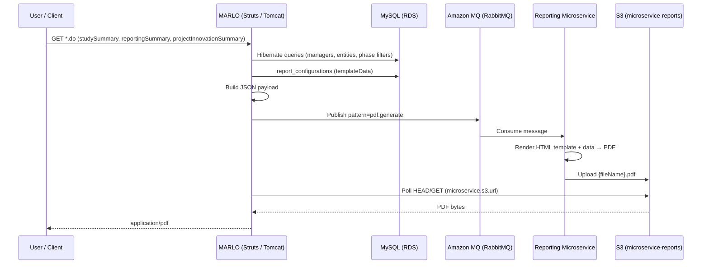
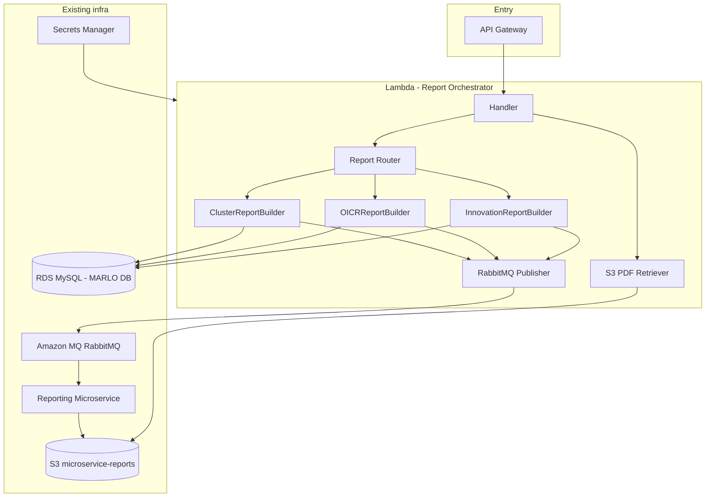
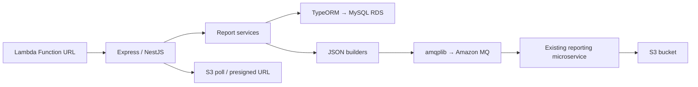

# Report Orchestrator — Analysis & Design

> **Status:** Draft — living document  
> **Last updated:** 2025-06-17  
> **Context:** MARLO will be decommissioned. This component replaces it as the **report orchestrator**.  
> **Constraint:** **No dedicated budget** for this project — processing must stay at **zero incremental cost** where possible. Database costs are out of scope (existing RDS).

---

## Objective

Replace MARLO as the report orchestrator before platform sunset with an **independent AWS Lambda component** that runs the full end-to-end flow:

1. Connect to the database (env vars)
2. Fetch report data
3. Send it to the reporting microservice (RabbitMQ queue)
4. Retrieve the generated PDF (S3 or presigned URL)
5. Return it to the caller

The **external microservice** (`reports.prms.cgiar.org`) and **S3 bucket** (`microservice-reports`) remain in place. This Lambda is the new **MARLO-lite for reports** — it does not replace the PDF renderer.

---

## What you are actually replacing

MARLO today does not merely "call the microservice". It performs **three responsibilities** the new component must take over:

| Layer | What MARLO does today | Where it lives |
|---|---|---|
| **1. Data extraction** | Queries DB via Hibernate + dozens of `Manager`s, builds report JSON | `ReportingSummaryAction` (~11,600 lines), `BaseStudySummaryData`, `ProjectInnovationSummaryAction` |
| **2. Template** | Loads HTML/template from `report_configurations` | `ReportConfiguration` in DB |
| **3. PDF generation** | Publishes to RabbitMQ (`pdf.generate`) and retrieves PDF from S3 | `MicroserviceReportAction` |

### Key MARLO source files

| Concern | File |
|---|---|
| Queue + S3 polling + API validation | `marlo-web/.../action/report/MicroserviceReportAction.java` |
| Configuration | `marlo-utils/.../utils/APConfig.java` |
| Cluster / project summary JSON | `marlo-web/.../action/summaries/ReportingSummaryAction.java` |
| OICR / study summary JSON | `marlo-web/.../action/summaries/BaseStudySummaryData.java` |
| Innovation summary JSON | `marlo-web/.../action/summaries/ProjectInnovationSummaryAction.java` |
| DB templates | `marlo-data/.../model/ReportConfiguration.java` |
| Struts routes (reference) | `struts-projects.xml`, `struts-summaries.xml`, `struts-report.xml` |

---

## Current flow in MARLO (as-is)



### Configuration properties (MARLO)

Defined in `marlo-web/src/main/resources/config/marlo-*.properties`, loaded via `APConfig`:

| Property | Purpose |
|---|---|
| `microservice.queueUrl` | AMQPS URI for Amazon MQ (RabbitMQ) |
| `microservice.queueName` | Target queue (e.g. `cgiar_ms2_prod_reports_queue`) |
| `microservice.userName` | Credentials embedded in JSON payload |
| `microservice.password` | Credentials embedded in JSON payload |
| `microservice.bucketName` | S3 bucket for generated PDFs |
| `microservice.s3.url` | Base S3 URL for polling/download |
| `microservice.reporting.url` | Reporting API base URL (e.g. `https://reports.prms.cgiar.org/api/`) |

> **Note:** `summary.microservice.url` (`https://ia.prms.cgiar.org/api/generate`) is a **separate** AI narrative flow (`AIReportService`). **Out of scope** for this Lambda.

### PDF retrieval (two paths in MARLO)

| Path | Mechanism | Used by summaries? |
|---|---|---|
| **Primary** | Poll `microservice.s3.url` + `fileName` (5 retries × 2s ≈ 10s) | Yes |
| **Alternate** | POST `{reporting.url}file-management/validation` with bucket + key | `fetchPDF.do` only |

The current polling window (**~10 seconds**) is insufficient for cold starts or large reports. The new service should use longer polling with backoff or an async model.

---

## Report types to cover

| Report | Typical input | Data logic | Struts entry | Queue method | Template field (`report_configurations`) |
|---|---|---|---|---|---|
| **Cluster / Project Summary** | `projectID`, `phaseID`, `cycle` | `ReportingSummaryAction.generateAndSendJson()` — partners, locations, OICRs, deliverables, innovations, activities… | `/{crp}/reportingSummary.do` | `sendClusterReportQueueMessage` | `projectTemplateData` |
| **OICR / Study Summary** | `studyID`, `phaseID` | `BaseStudySummaryData.generateAndSendJson()` — 100+ fields per study | `/{crp}/studySummary.do` | `sendOICRsQueueMessage` | `oicrTemplateData` |
| **Innovation Summary** | `innovationID`, `phaseID` | `ProjectInnovationSummaryAction.generateAndSendJson()` | `/{crp}/projectInnovationSummary.do` | `sendInnovationsQueueMessage` | `innovationTemplateData` |

**Pentaho fallback:** OICR and Innovation can still use Pentaho when specificity `GENERATE_PENTAHO_INNOVATIONS_REPORT_ACTIVE` is enabled. Cluster summary has Pentaho disabled (`generatePentahoReport = false`). Post-MARLO, only the microservice path matters unless Pentaho is explicitly required.

### Queue contract (unchanged)

Each report produces the same contract:

```json
{
  "pattern": "pdf.generate",
  "data": {
    "templateData": "...",
    "data": { ... },
    "options": { "format": "A4", "orientation": "portrait", "timeout": "300000", ... },
    "fileName": "AICCRA-Cluster-102080-Summary-....pdf",
    "bucketName": "microservice-reports",
    "credentials": "{\"username\":\"...\",\"password\":\"...\"}"
  }
}
```

---

## Proposed architecture (to-be)



### Responsibilities by layer

| Layer | Owner | Notes |
|---|---|---|
| Data extraction & JSON assembly | **This Lambda** | Hardest part — thousands of lines of Java today |
| Templates | **MySQL** (`report_configurations`) or migrated to S3 | TBD |
| PDF rendering | **Existing microservice** | Consumes `pdf.generate` from queue |
| PDF storage | **S3** | Unchanged |
| Client download | **This Lambda** (presigned URL or bytes) | Replaces Struts `StreamResult` |

---

## Proposed API (service contract)

```
POST /reports/cluster
  { "projectId": 102080, "phaseId": 407, "cycle": "Reporting" }

POST /reports/oicr
  { "studyId": 3517, "phaseId": 407 }

POST /reports/innovation
  { "innovationId": 1234, "phaseId": 407 }
```

**Async response (recommended):**

```json
{
  "jobId": "uuid",
  "status": "processing",
  "fileName": "AICCRA-Cluster-102080-Summary-20250617_1430.pdf"
}
```

**Sync response (if the client requires immediate download):**

```json
{
  "fileName": "...",
  "downloadUrl": "https://s3.../presigned",
  "status": "ready"
}
```

**Status polling (async):**

```
GET /reports/jobs/{jobId}
```

---

## Required environment variables

```bash
# Database (same MARLO RDS, in VPC)
DB_HOST=
DB_PORT=3306
DB_NAME=
DB_USER=
DB_PASSWORD=              # prefer Secrets Manager

# Reporting microservice (queue)
MQ_URL=                   # microservice.queueUrl
MQ_QUEUE_NAME=            # microservice.queueName
MS_USERNAME=              # microservice.userName
MS_PASSWORD=              # microservice.password
MS_BUCKET=                # microservice.bucketName
MS_S3_URL=                # microservice.s3.url
MS_REPORTING_URL=         # microservice.reporting.url (presigned URL fallback)

# Operation
PDF_POLL_MAX_RETRIES=30
PDF_POLL_INTERVAL_MS=2000
PDF_POLL_BACKOFF=exponential
REPORT_OUTPUT_PREFIX=AICCRA

# Optional — async jobs
JOBS_TABLE=               # DynamoDB table for job status
```

---

## Main challenge: the data layer (not Lambda)

Lambda is a good fit for **orchestration**. The hard part is **replicating business logic** currently embedded in Java/Hibernate.

### Complexity by report type

| Report | Approx. scope in MARLO | Key methods |
|---|---|---|
| **Cluster** | `ReportingSummaryAction` ~11.6k lines | `buildProjectDescriptionSection`, `buildOICRsList`, `buildDeliverablesList`, `buildInnovationsList`, `buildActivitiesList`, … |
| **OICR** | `BaseStudySummaryData.generateAndSendJson` ~2k+ lines | 100+ fields per study, geographic scopes, SRF targets, publications, … |
| **Innovation** | `ProjectInnovationSummaryAction.generateAndSendJson` | Innovation-specific fields and nested data |

### Complexity example — cluster report

In `ReportingSummaryAction` alone:

- `buildProjectDescriptionSection()`
- `buildProjectPartnersData()`
- `buildOICRsList()` → `buildOICRData()` (~600 lines)
- `buildDeliverablesList()` → `buildDeliverableData()`
- `buildInnovationsList()` → `buildInnovationData()`
- `buildActivitiesList()`
- …dozens of implicit joins via JPA entities

This implies **hundreds of tables** and business rules:

- Filters by `phase`, `isActive`
- Dynamic specificities (in MARLO)
- HTML formatting (`htmlParser.plainTextToHtml`)
- Partial i18n
- AICCRA naming prefixes, etc.

### Viable strategies (lowest to highest effort)

#### 1. Capture prod JSON and reverse-engineer (fast, fragile)

- Generate real JSONs from MARLO for N projects/studies.
- Write SQL queries that reproduce that structure.
- **Pros:** start in weeks.
- **Cons:** hard to maintain exact parity; risk of incorrect reports.
- **Use:** discovery phase only.

#### 2. SQL views / stored procedures (recommended baseline)

- Create materialized views or SPs that expose aggregated data per report.
- Lambda runs SQL + assembles JSON + publishes to queue.
- **Pros:** decoupled from MARLO/Java; performant; testable.
- **Cons:** data model must be documented (today implicit in Java).

#### 3. Extract Java module as Lambda Container (maximum parity)

- Extract `marlo-data` + builders into a standalone JAR.
- Deploy as **Lambda Container Image** (Java 17).
- **Pros:** identical behaviour to MARLO.
- **Cons:** high cold starts, large image, still tied to Hibernate.

#### 4. Reimplement in Node/Python (medium term)

- Port `build*()` methods to TypeScript/Python with explicit SQL.
- **Pros:** native Lambda; agile team workflow.
- **Cons:** 2–4 months depending on report types and coverage.

**Decision:** _TBD — confirm after golden JSON capture and team capacity review._

### Runtime & data access: Node + TypeORM vs Spring Boot

This section compares running all DB queries from Lambda using **Node.js + TypeORM** versus **Spring Boot + JPA/Hibernate** (reusing MARLO patterns).

#### What MARLO actually does today (relevant to both options)

MARLO is not "a few queries". It is **graph navigation + business rules**:

- **~546 JPA entity classes** in `marlo-data`
- **`ReportingSummaryAction` alone injects ~40 managers** (each wrapping DAO/repository logic)
- Phase-scoped access via custom methods (e.g. `study.getProjectExpectedStudyInfo(phase)`) — not plain `@ManyToOne`
- In-memory filtering with Java streams (`isActive`, year, phase equality) before mapping to JSON
- HTML sanitization, i18n keys, and CRP-specific naming mixed into builders

Example from cluster report — OICR list is not one SQL query; it merges direct and shared studies, then calls `buildOICRData()` per entity:

```8550:8590:marlo-web/src/main/java/org/cgiar/ccafs/marlo/action/summaries/ReportingSummaryAction.java
  private List<Map<String, Object>> buildOICRsList() {
    // ... stream filters on project.getProjectExpectedStudies()
    // ... stream filters on project.getExpectedStudyProjects() (shared studies)
    // ... for each study → buildOICRData(projectExpectedStudy)
  }
```

**Implication:** "Use an ORM" does not remove work — it only helps if you **port the entity model and builders**, or if you **ignore the ORM for reads** and use targeted SQL anyway.

---

#### Option A — Node.js + TypeORM

| Aspect | Assessment |
|---|---|
| **Lambda fit** | Excellent — cold start ~100–500ms, package ~5–20MB |
| **TypeORM for full MARLO schema** | **Not recommended** — mapping 546 entities + relations is months of work and duplicates Hibernate |
| **TypeORM for minimal entities** | OK for `report_configurations` + job metadata (1–3 tables) |
| **Recommended data access** | **`mysql2` / `pg` + raw SQL** or **Kysely** / **Prisma raw queries** for report payloads |
| **Porting builders** | Rewrite `build*()` in TypeScript — same effort as SQL-first approach |
| **Connection pooling** | Lambda-friendly pool (e.g. `mysql2` with low `connectionLimit`, or **RDS Proxy** strongly recommended) |

**What "lighter" really means here:**

TypeORM is lighter than Hibernate **as a runtime**, not lighter **as a migration project** if the goal is to mirror MARLO's object graph. The light path on Node is:

```
Lambda (Node) → RDS Proxy → SQL views / parameterized queries → JSON assembly → MQ
```

TypeORM adds value only for a **small, stable subset** of tables (templates, phases, projects header).

**Risks on Node:**

- No reuse of MARLO Java code — full rewrite of business rules
- Easy to miss subtle filters (`isActive`, phase/year scoping, shared vs owned entities)
- Team must maintain parity tests against golden JSONs from MARLO

**When Node + TypeORM/SQL wins:**

- Team is stronger in TypeScript
- Reports are redefined with **SQL views** as the contract (TypeORM optional)
- Async API from day one; fast iteration on Lambda

---

#### Option B — Spring Boot (JPA/Hibernate)

| Aspect | Assessment |
|---|---|
| **Lambda fit** | Poor-to-fair as zip deployment; **fair-to-good as container image** with SnapStart (Java 17+) |
| **Cold start** | 3–15s without SnapStart; 1–3s with SnapStart + slim context |
| **Package size** | 50–150MB+ (Spring Boot + Hibernate + marlo-data subset) |
| **Memory** | Typically 1024MB+ for comfortable Hibernate session |
| **Code reuse** | **Highest** — can extract `marlo-data` entities, managers, even builder classes |
| **Parity with MARLO** | Best path to identical PDFs short-term |

**Deployment patterns:**

| Pattern | Description | Verdict |
|---|---|---|
| Spring Boot **fat JAR on Lambda** | Single function, full context | Heavy cold starts; viable with provisioned concurrency |
| **Lambda Container Image** + trimmed Spring context | Only wire managers needed for reports | Best Java-on-Lambda compromise |
| **Spring Boot on ECS Fargate** (not Lambda) | Always-on small service | Better if sync PDF wait is required; simpler ops for Hibernate |
| **Extract builders only** into a library, call from minimal Spring app | Smaller context | Good middle ground |

**What reuse looks like:**

```
report-orchestrator-java/
  ├── marlo-data (subset or full dependency)
  ├── report-builders (extracted from ReportingSummaryAction, etc.)
  └── spring-boot-starter — REST handler + MicroserviceReportAction port
```

You would **not** need Struts, interceptors, or the full `marlo-web` WAR — but Hibernate config, datasource, and entity scanning still apply.

**Risks on Spring Boot:**

- Lambda timeout + cold start + long cluster report generation = tight margin for sync API
- Hibernate lazy-loading pitfalls (MARLO already hit OOM issues with deep streams in other reports)
- Still coupled to legacy schema and entity design
- Larger operational cost if provisioned concurrency is required

**When Spring Boot wins:**

- Parity is non-negotiable and timeline is short
- Team already knows MARLO Java codebase
- Willing to use **container Lambda** or **Fargate** instead of pure zip Lambda

---

#### Side-by-side summary

| Criterion | Node + TypeORM/SQL | Spring Boot + Hibernate |
|---|---|---|
| Lambda cold start | ⭐⭐⭐⭐⭐ | ⭐⭐ (⭐⭐⭐ with SnapStart + container) |
| Reuse MARLO code | ❌ None | ⭐⭐⭐⭐⭐ |
| Time to first OICR report | Medium (SQL + rewrite) | Medium-fast (extract Java) |
| Time to full cluster parity | Long (rewrite all builders) | Shorter (port existing builders) |
| Long-term maintainability | ⭐⭐⭐⭐ if SQL views are the contract | ⭐⭐⭐ (legacy entity coupling) |
| RDS connection handling | Needs RDS Proxy | Needs RDS Proxy |
| Team TypeScript-first | ⭐⭐⭐⭐⭐ | ⭐⭐ |
| Team Java-first | ⭐⭐ | ⭐⭐⭐⭐⭐ |

---

#### Recommended hybrid (pragmatic)

Neither "full TypeORM of MARLO schema" nor "full Spring Boot monolith on Lambda" is ideal as-is.

| Layer | Recommendation |
|---|---|
| **Compute** | Node Lambda **or** Java container Lambda — decide by team skill |
| **Data contract** | **SQL views / SPs per report** in MySQL (language-agnostic) |
| **ORM role** | Minimal — templates + job table only; not 546 entities |
| **Business mapping** | TypeScript/Java services that map view rows → JSON shape expected by microservice |
| **Parity gate** | Golden JSON diff tests from MARLO before each report goes live |
| **Connections** | **RDS Proxy** mandatory for both runtimes |

If the team chooses **Node**: use TypeORM optionally for 2–3 tables; use **raw SQL** for report data.

If the team chooses **Spring Boot**: extract **builders + subset of managers**, deploy as **container Lambda** or **Fargate**; do not boot the full MARLO web stack.

---

#### Decision impact on open items D1 / D3

| Decision | Node + SQL (TypeORM minimal) | Spring Boot + marlo-data |
|---|---|---|
| D1 Runtime | Node.js 20.x | Java 17 container Lambda or Fargate |
| D3 Data access | Raw SQL + views; TypeORM for templates | Hibernate managers + gradual SQL view extraction |
| First milestone | OICR via 3–5 SQL queries + TS mapper | OICR via extracted `BaseStudySummaryData` logic |
| Infra extras | RDS Proxy | RDS Proxy + possibly provisioned concurrency |

---

## Zero-budget constraint (processing)

There is **no funding** for new infrastructure. Processing design must minimize **new AWS line items** and maximize **free-tier / already-paid** resources.

Database (RDS) is a separate concern — assumed to remain as-is. This section covers **compute, orchestration, and integration only**.

### Cost map of the current reporting chain

| Component | Typical billing | Status for this project |
|---|---|---|
| **RDS MySQL** | Paid (existing) | Reuse — not a new cost |
| **Amazon MQ** (RabbitMQ) | Paid (~$20–50+/mo per broker) | Reuse existing broker + queue — **no new broker** |
| **Reporting microservice** | Paid (existing EC2/ECS?) | Reuse — no replacement budget |
| **S3** (`microservice-reports`) | Low per-request | Reuse; HEAD/GET within free tier at low volume |
| **Lambda** | Free tier: 1M req/mo + 400k GB-seconds/mo | **Primary zero-cost compute candidate** |
| **Lambda Function URL** | No additional charge | Prefer over API Gateway |
| **API Gateway** | Paid per request (limited free tier) | **Avoid** |
| **RDS Proxy** | ~$0.015/vCPU-hr + capacity units | **Avoid** — direct RDS connection with tiny pool |
| **NAT Gateway** | ~$32+/mo + data | **Avoid** — use VPC endpoints where needed |
| **Secrets Manager** | ~$0.40/secret/mo | **Avoid** — SSM Parameter Store (standard) or Lambda env vars |
| **DynamoDB** (job store) | Paid per request | **Avoid** — job table in existing MySQL |
| **Step Functions** | Paid per transition | **Avoid** — inline async in Lambda or MySQL job polling |
| **Provisioned Concurrency** | Paid | **Avoid** — accept cold starts |
| **ECS Fargate / new EC2** | Paid | **Avoid** unless reusing MARLO instance at zero marginal cost |

### Architecture options ranked by incremental cost

#### Tier 0 — Zero new AWS services (preferred if MARLO EC2 remains)

Run the orchestrator on **existing compute** that is already paid for (e.g. the MARLO EC2 instance until decommission, or another shared VM).

```
Client → HTTP on existing EC2 (Node/Python/Java process)
       → MySQL (existing RDS)
       → Amazon MQ (existing broker)
       → S3 poll (existing bucket)
```

| Pros | Cons |
|---|---|
| Truly zero new billing lines | Must share ops with legacy server or migrate later |
| No Lambda cold starts | Not "serverless"; needs process supervisor (systemd, pm2) |
| No VPC/NAT complexity | Tied to machine lifecycle |

**Best when:** MARLO server stays up for months during transition and has spare CPU/RAM.

---

#### Tier 1 — AWS Lambda free tier only (recommended if EC2 goes away)

Single **Node.js** Lambda (zip deployment, not container) with strict resource limits.

```
Client → Lambda Function URL (free)
       → MySQL in VPC (existing RDS, connectionLimit=1–2)
       → Amazon MQ via VPC (existing broker)
       → S3 via Gateway VPC Endpoint (free, no NAT)
```

| Setting | Target (free-tier friendly) |
|---|---|
| Runtime | Node.js 20.x |
| Memory | 256–512 MB |
| Timeout | 60–120s (async pattern preferred) |
| Deployment | Zip (<10 MB) — no container images |
| Entry | **Function URL** — not API Gateway |
| Job status | Table in **existing MySQL** — not DynamoDB |
| Secrets | **SSM Parameter Store (Standard)** — free |
| S3 access from VPC | **S3 Gateway Endpoint** — free |

**Why Node over Spring Boot under zero budget:**

| Factor | Node.js Lambda | Spring Boot Lambda |
|---|---|---|
| Cold start | ~100–500 ms | 3–15 s |
| GB-seconds per report | Low | High (1024 MB+ typical) |
| Free tier headroom | Fits many reports/month | Burns quota ~5–10× faster |
| Container image | Not needed | Often required → more GB-seconds |

Spring Boot is viable **only** if hosted on **existing EC2 at zero marginal cost**, not as a new Lambda workload.

---

#### Tier 2 — Acceptable if already paid (reuse only, do not add)

| Service | Rule |
|---|---|
| Amazon MQ | Publish to **existing** queue only — do not provision a new broker |
| S3 | Read/write existing bucket — no new bucket unless org absorbs cost |
| CloudWatch Logs | Stay within 5 GB/mo free ingestion; short log lines, no payload dumps |

---

#### Tier 3 — Do not use (creates cost)

- API Gateway, RDS Proxy, NAT Gateway, Secrets Manager, DynamoDB, Step Functions, Provisioned Concurrency, new Fargate tasks, new EC2 instances, EventBridge paid rules beyond free tier.

---

### Zero-cost networking pattern (Lambda + RDS in VPC)

MARLO RDS is private. Lambda must run in VPC. **Do not add a NAT Gateway.**

```
Lambda (private subnet)
  ├──→ RDS MySQL (same VPC, security group rule)     — direct, free
  ├──→ Amazon MQ (same VPC)                            — direct, free
  └──→ S3 (Gateway VPC Endpoint)                       — free, no NAT
```

**Connection pooling without RDS Proxy:**

- Use `mysql2` with `connectionLimit: 1` per Lambda instance
- Keep handlers stateless; open → query → close
- At low report volume (sunset / legacy usage), this is sufficient

---

### Processing model under zero budget

Sync blocking (like MARLO today) is expensive in Lambda GB-seconds. Prefer **async without paid orchestrators**:

```
POST /reports/oicr  →  Lambda writes job row (MySQL, status=pending)
                    →  publishes to MQ
                    →  returns { jobId, status: processing } immediately

GET /reports/jobs/{id}  →  Lambda checks S3 HEAD or job row
                        →  returns { status: ready, downloadUrl }
```

No DynamoDB, no Step Functions, no SQS (unless an org already pays for it).

Optional **zero-cost trigger** for batch reports: EventBridge schedule (free tier includes custom events) or cron on existing EC2.

---

### Revised recommendation (zero-budget)

| Priority | Choice |
|---|---|
| **Compute** | Node.js Lambda (zip) **or** existing EC2 sidecar — whichever avoids new billing |
| **HTTP entry** | Lambda Function URL |
| **Data access** | Raw SQL + views in existing MySQL — no ORM for 546 entities |
| **ORM** | None required; optional minimal queries for `report_configurations` only |
| **Job tracking** | MySQL table on existing RDS |
| **Secrets** | SSM Parameter Store (Standard) |
| **Async** | MySQL job table + client polling — no DynamoDB/Step Functions |
| **MQ + PDF** | Reuse existing Amazon MQ + reporting microservice + S3 |

**Spring Boot** remains valid only as an **EC2 sidecar** on already-paid hardware for maximum MARLO code reuse — not as a new Lambda container workload.

---

### Open decision: D9 — Compute placement

| Option | Incremental cost | Notes |
|---|---|---|
| **D9a** | Node Lambda + Function URL | Best if MARLO EC2 is decommissioned |
| **D9b** | Node/Java sidecar on existing EC2 | Best if server stays up during transition |
| **D9c** | Spring Boot on existing EC2 | Code reuse; zero new AWS services |

_Decision:_ **D9a — Node.js Lambda (free tier) + Function URL**

---

## Proposed implementation stack (draft)

Direction agreed for implementation: **Node.js on AWS Lambda**, HTTP layer with **Express or NestJS**, **TypeORM** for database access, plus queue and S3 clients for the existing reporting pipeline.

### High-level flow



### Module responsibilities

| Module | Responsibility | MARLO equivalent |
|---|---|---|
| **HTTP** (`/reports/oicr`, `/reports/cluster`, …) | Routing, validation, auth | Struts `*.do` actions |
| **Report services** | Orchestrate per report type | `StudySummaryAction`, `ReportingSummaryAction`, … |
| **TypeORM repositories** | Load data from MySQL | `Manager` + `DAO` + Hibernate |
| **JSON builders** | Map rows/entities → `pdf.generate` payload | `generateAndSendJson()`, `build*()` methods |
| **Template loader** | Read `report_configurations` | `ReportConfigurationManager` |
| **Queue publisher** | Publish to RabbitMQ | `MicroserviceReportAction.send*QueueMessage()` |
| **S3 client** | Poll or presign PDF URL | `downloadPDFByURL()` |
| **Job store** (optional) | Async status in MySQL | _new — no MARLO equivalent_ |

### Express vs NestJS on Lambda

| | Express + `@codegenie/serverless-express` | NestJS + `@nestjs/platform-aws-lambda` |
|---|---|---|
| **Cold start** | Lower (smaller bundle) | Higher (framework overhead) |
| **Structure** | Manual; fine for 3 report types | Modules, DI, clearer as codebase grows |
| **Free tier fit** | Slightly better | Good if bundle kept lean (no Swagger in prod) |
| **Recommendation** | Start here if team is small | Prefer if you expect many report types / shared infra |

Both are valid. For zero budget, **Express is the default** unless the team already standardizes on Nest.

### How to use TypeORM (important)

**Do not** map the full MARLO schema (~546 entities). Use TypeORM **incrementally**:

| Use TypeORM for | Avoid TypeORM for |
|---|---|
| `report_configurations` (template row) | Full `Project` graph with 50+ relations |
| `report_jobs` (async job table — new) | Copying every `@OneToMany` from Java entities |
| Per-report entities as you add them (OICR first) | Lazy-loading chains like Hibernate |

**Preferred patterns per report:**

1. **TypeORM entities** for 5–15 tables directly involved in OICR (study, study_info, countries, …)
2. **QueryBuilder / raw SQL** for heavy joins (deliverables list, cluster nested sections)
3. **SQL views** in MySQL where MARLO logic is too deep — TypeORM maps the view as a read-only entity

This mirrors what MARLO does implicitly: a few explicit manager calls + lots of joined data, without dragging the entire ORM graph.

### Suggested package layout

```
report-orchestrator/
  src/
    lambda.ts                 # handler → Express/Nest bootstrap
    config/                   # env, TypeORM DataSource (connectionLimit: 1)
    modules/
      reports/
        reports.controller.ts
        oicr/
          oicr.service.ts
          oicr.builder.ts     # JSON shape for pdf.generate
          entities/             # TypeORM entities (subset only)
          oicr.repository.ts
        cluster/                # phase 4
        innovation/             # phase 3
      template/
        template.service.ts     # report_configurations
      queue/
        queue.service.ts        # amqplib publish
      storage/
        s3.service.ts           # poll HEAD / presigned URL
      jobs/
        job.entity.ts           # optional async tracking
    shared/
      pdf-payload.types.ts      # pdf.generate contract
```

### Key libraries

| Concern | Library |
|---|---|
| HTTP on Lambda | `@codegenie/serverless-express` or `@vendia/serverless-express` |
| Framework (optional) | `@nestjs/core` + `@nestjs/platform-aws-lambda` |
| ORM | `typeorm` + `mysql2` |
| RabbitMQ | `amqplib` |
| S3 | `@aws-sdk/client-s3` |
| Bundling | `esbuild` (keep zip <10 MB) |

### TypeORM + Lambda connection notes

- Initialize `DataSource` **outside** the handler (reuse across warm invocations).
- Set `extra: { connectionLimit: 1 }` — no RDS Proxy (cost).
- Do **not** rely on long-lived pools; Lambda freezes/thaws instances.
- Run Lambda in **VPC** with **S3 Gateway Endpoint** (free) for S3 access without NAT.

### What this stack replaces vs keeps

| Replaced | Kept (unchanged) |
|---|---|
| Struts actions + Java builders | Reporting microservice (PDF render) |
| Hibernate / 40 managers | Amazon MQ queue + `pdf.generate` contract |
| `MicroserviceReportAction` (Java) | S3 bucket |
| Tomcat sync PDF download | — |

### Updated decisions

| # | Decision | Value |
|---|---|---|
| D1 | Runtime | **Node.js 20.x** |
| D3 | Data access | **TypeORM (incremental entities) + QueryBuilder/raw SQL + SQL views** |
| D9 | Compute | **Lambda free tier + Function URL** |
| D2 | API style | **Lean async** (job row in MySQL + polling) — _confirm_ |
| D6 | First report | **OICR** — _confirm_ |

---

```typescript
async function generateClusterReport(event) {
  const { projectId, phaseId, cycle } = event;

  // 1. Data from DB
  const projectData = await db.queryClusterReportData(projectId, phaseId, cycle);
  const template = await db.getTemplate('projectTemplateData');

  // 2. Build payload (same contract as MARLO)
  const payload = {
    pattern: 'pdf.generate',
    data: {
      templateData: template,
      data: projectData,
      options: { format: 'A4', orientation: 'portrait', timeout: '300000', ... },
      fileName: `AICCRA-Cluster-${projectId}-Summary-${timestamp()}.pdf`,
      bucketName: process.env.MS_BUCKET,
      credentials: JSON.stringify({ username: MS_USER, password: MS_PASS })
    }
  };

  // 3. Publish to RabbitMQ
  await publishToQueue(process.env.MQ_URL, process.env.MQ_QUEUE_NAME, payload);

  // 4. Wait for PDF on S3 (polling with backoff)
  const pdfUrl = await pollS3(`${process.env.MS_S3_URL}${payload.data.fileName}`);

  // 5. Return presigned URL or bytes
  return { status: 'ready', downloadUrl: pdfUrl, fileName: payload.data.fileName };
}
```

---

## Important design decisions

### Sync vs async

MARLO blocks the Tomcat thread waiting for the PDF (~10s polling). In Lambda:

| Mode | When to use |
|---|---|
| **Sync** (API Gateway → Lambda → PDF) | Only if reports consistently finish in <25s |
| **Async** (202 + jobId + polling/webhook) | Recommended for large cluster reports |

For async, use **DynamoDB** (`jobId`, `status`, `s3Key`) or **SQS + Step Functions**.

### Credentials in JSON

MARLO today sends `username/password` inside the payload. In the new component:

- Lambda should use an **IAM role** for S3.
- Microservice credentials in **Secrets Manager**, not in the message body (if the microservice allows it).

### VPC

Lambda must run in the **same VPC** as RDS MySQL (private subnets + security group).

### Templates

Keep reading from `report_configurations` in DB, or migrate to **S3** before MARLO sunset.

### Open decisions

| # | Question | Options | Decision |
|---|---|---|---|
| D1 | Runtime | Node.js / Python / Java container | **Node.js 20.x (Express or Nest)** |
| D2 | Sync vs async API | Sync (<25s) / Async (202 + jobId) | _TBD — lean async_ |
| D3 | Data access | SQL + views / Port ORM / Hybrid | **TypeORM incremental + QueryBuilder/views** |
| D4 | Template source | `report_configurations` table / S3 copy | _TBD_ |
| D5 | Credentials in MQ payload | Keep current contract / IAM only | _TBD — depends on microservice_ |
| D6 | First report | OICR / Innovation / Cluster | _TBD — lean OICR_ |
| D7 | API auth | API key / IAM / Cognito / m2m | _TBD_ |
| D8 | Async job store | DynamoDB / None (sync only) | **MySQL job table (zero cost)** |
| D9 | Compute placement | Node Lambda (free tier) / EC2 sidecar / Spring on EC2 | **Lambda free tier + Function URL** |

---

## Suggested migration plan (phases)

| Phase | Deliverable | Est. duration |
|---|---|---|
| **0 — Inventory** | List active reports post-MARLO; capture golden JSONs from prod; map tables | 1–2 weeks |
| **1 — Lambda skeleton** | API + DB connection + MQ publish + S3 poll (no business logic) | 1 week |
| **2 — OICR** (smallest scope) | First end-to-end report in Lambda | 2–3 weeks |
| **3 — Innovation** | Second report type | 2 weeks |
| **4 — Cluster** (largest) | Equivalent to `ReportingSummaryAction` | 4–8 weeks |
| **5 — Hardening** | Parity tests vs MARLO, async, monitoring, alarms | 2 weeks |

---

## Practical implications (summary)

| Area | Implication |
|---|---|
| **New code** | Full service: API + data layer + MQ client + S3 client |
| **Database** | Read-only access to MARLO RDS; ideally new views/SPs |
| **AWS infra** | Lambda (VPC), API Gateway, Secrets Manager, S3/MQ permissions |
| **Existing microservice** | Stays; only the queue publisher changes |
| **Hard to move to Lambda** | Struts, sessions, dynamic specificities, Pentaho legacy |
| **Main risk** | Data parity — a report that is "almost correct" is not acceptable |

---

## Concrete recommendation

For a MARLO sunset, the safest path is:

1. **Lambda as orchestrator** (Node/Python or Java container per team preference).
2. **SQL data layer** (views/SPs) instead of porting Hibernate.
3. **Async contract from day one** (do not replicate MARLO's blocking polling).
4. **Start with OICR** (narrow scope, single `studyId`) and validate PDF parity vs MARLO before cluster.

---

## AWS infrastructure checklist

- [ ] Lambda function (VPC-enabled for RDS access)
- [ ] API Gateway REST or HTTP API
- [ ] Secrets Manager (DB password, MQ credentials, MS credentials)
- [ ] Security groups (Lambda → RDS, Lambda → Amazon MQ)
- [ ] IAM role (S3 read, Secrets Manager, optional DynamoDB)
- [ ] CloudWatch logs + alarms (errors, duration, DLQ if using SQS)
- [ ] Optional: DynamoDB for async job tracking
- [ ] Optional: Provisioned concurrency (if sync path required)

---

## Parity validation

Before MARLO shutdown, each report type must pass:

1. **JSON diff** — Lambda payload vs MARLO payload (normalized, ignoring timestamps/fileName)
2. **Visual PDF diff** — byte comparison or visual review on a representative sample
3. **Regression set** — minimum N entities per type (edge cases: empty sections, long text, multi-partner, etc.)

Golden test entities: _TBD_

---

## Out of scope

- Replacing the PDF rendering microservice (headless Chrome / NestJS consumer)
- Pentaho `.prpt` reports (legacy path)
- AI narrative reports (`summary.microservice.url` / `AIReportService`)
- MARLO UI, Struts sessions, specificities engine (unless explicitly ported)
- Write access to the MARLO database

---

## Next steps

- [ ] Confirm which report types are required post-MARLO sunset
- [ ] Capture 3–5 golden JSON payloads per type from prod/staging
- [ ] Choose runtime (D1) and first report type (D6)
- [ ] Draft SQL inventory for OICR report tables
- [ ] Align with reporting microservice owners on queue contract stability
- [ ] Define API consumers (who will call this Lambda after MARLO is gone?)
- [ ] Define new service repo structure
- [ ] Initial SQL schema for one report (OICR or cluster)
- [ ] Formal ADR/spec under `docs/specs/` if traceability in MARLO is required before sunset

---

## Changelog

| Date | Author | Change |
|---|---|---|
| 2025-06-17 | — | Initial document from MARLO codebase analysis |
| 2025-06-17 | — | Full objective, layers, strategies, and recommendations integrated |
| 2025-06-17 | — | Proposed stack: Node Lambda + Express/Nest + TypeORM + amqplib |
